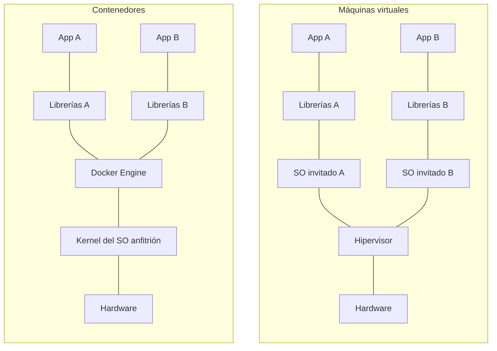
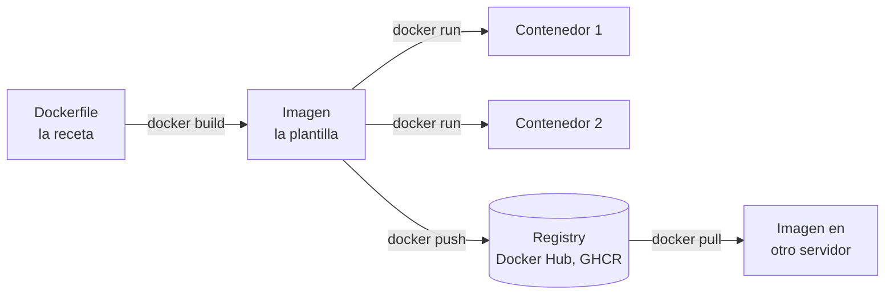
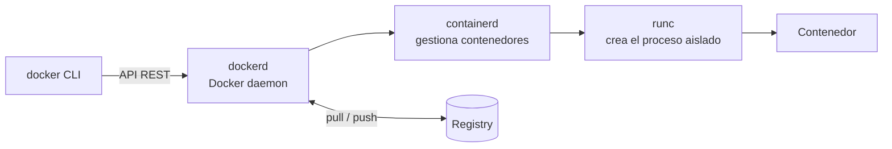
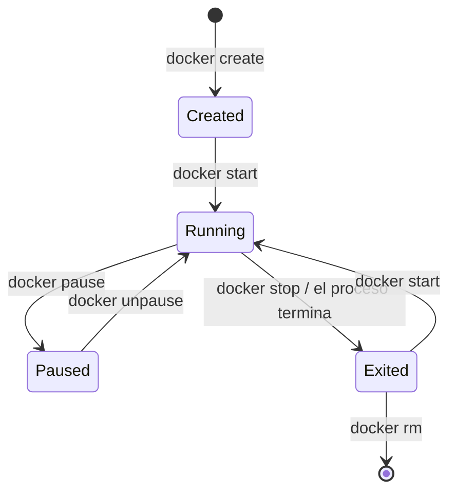
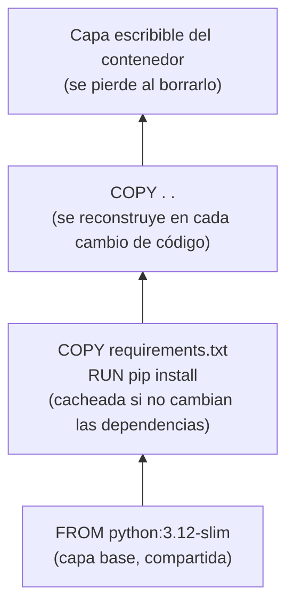
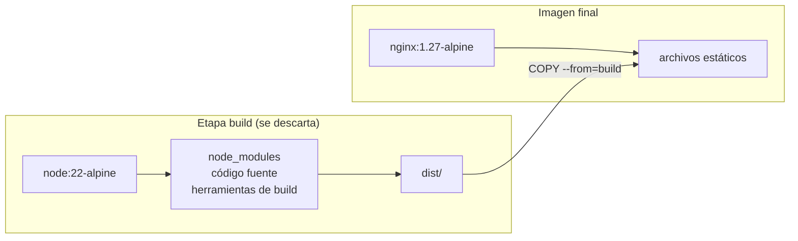
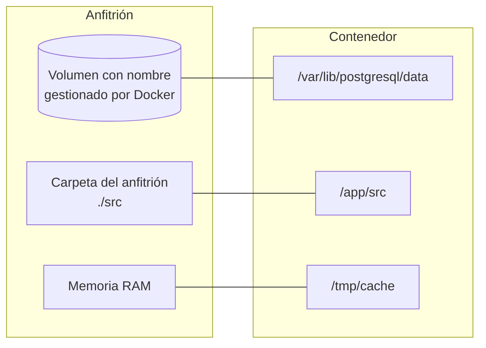
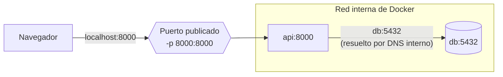

---
aliases:
  - Docker
  - Contenedores
tags:
  - devops
  - contenedores
  - infraestructura
categoria: DevOps
created: 2026-10-01
---

# Docker

> [!abstract] Resumen
> Docker es una plataforma para **empaquetar una aplicación junto con todo lo que necesita para correr** (runtime, librerías, configuración) en una unidad llamada **contenedor**. Ese contenedor funciona igual en tu notebook, en el servidor de un compañero o en producción.

> [!example] Analogía: el contenedor de carga
> Antes de los contenedores de carga estándar, cada barco se cargaba distinto según la mercadería: bolsas, barriles, cajas. El contenedor metálico estandarizó todo: a la grúa no le importa qué hay adentro, solo sabe moverlo. Docker hace lo mismo con el software: a quien lo ejecuta no le importa si adentro hay Python, Node o Java.

## Key points

- [k] Resuelve el clásico **"en mi máquina funciona"**: el entorno viaja con la app
- [k] Una **imagen** es la plantilla (solo lectura); un **contenedor** es una instancia corriendo de esa imagen
- [k] Los contenedores **comparten el kernel** del sistema operativo anfitrión: por eso son mucho más livianos que una máquina virtual
- [k] Las imágenes se construyen en **capas** que se cachean y se reutilizan
- [k] Un contenedor es **efímero**: lo que no esté en un volumen se pierde al borrarlo

## El problema que resuelve

> [!question] "En mi máquina funciona"
> La app anda en tu computadora con Python 3.12 y Postgres 16, pero en el servidor hay Python 3.9, a otra persona del equipo le falta una librería del sistema y en producción una variable de entorno tiene otro valor. Cada entorno es distinto, y cada diferencia es un bug potencial.

Con Docker, el entorno se describe en un archivo (`Dockerfile`), se construye una vez como imagen, y esa misma imagen se ejecuta en todos lados.

## Contenedores vs. máquinas virtuales



| | Máquina virtual | Contenedor |
|---|---|---|
| Qué virtualiza | El **hardware** completo | El **sistema operativo** (procesos aislados) |
| Sistema operativo | Uno completo por VM | Comparte el kernel del anfitrión |
| Tamaño típico | Gigabytes | Megabytes |
| Arranque | Minutos | Segundos o menos |
| Aislamiento | Muy fuerte | Bueno, pero el kernel es compartido |
| Cuándo conviene | Correr otro SO, aislamiento estricto | Empaquetar y desplegar aplicaciones |

> [!info] ¿Y en Windows o macOS?
> Los contenedores de Linux necesitan un kernel Linux. Docker Desktop resuelve esto corriendo una **máquina virtual Linux liviana** por detrás (en Windows, a través de **WSL 2**). Por eso Docker en Windows consume más recursos que en un servidor Linux.

## Cómo funciona por dentro

Un contenedor no es magia: es un **proceso común de Linux** con tres mecanismos del kernel encima.

| Mecanismo | Qué hace | Ejemplo |
|---|---|---|
| **Namespaces** | Aíslan lo que el proceso **ve** | Tiene sus propios PIDs (se ve a sí mismo como PID 1), su propia red, su propio hostname y su propio sistema de archivos |
| **cgroups** | Limitan lo que el proceso **usa** | Máximo 512 MB de RAM o medio núcleo de CPU |
| **Union filesystem** (OverlayFS) | Apila capas de solo lectura y agrega una capa escribible arriba | Diez contenedores de la misma imagen comparten las capas base en disco |

> [!tip] Para recordarlo
> **Namespaces** = qué puede ver. **cgroups** = cuánto puede usar.

## Conceptos clave



| Concepto | Qué es | Analogía en POO |
|---|---|---|
| **Dockerfile** | Archivo de texto con las instrucciones para construir una imagen | El código fuente de la clase |
| **Imagen** | Plantilla inmutable, formada por capas | La clase |
| **Contenedor** | Instancia en ejecución de una imagen, con una capa escribible propia | Un objeto (instancia) |
| **Registry** | Servidor que almacena y distribuye imágenes (Docker Hub, GitHub Container Registry) | Un repositorio de paquetes, como PyPI o npm |
| **Volumen** | Almacenamiento que sobrevive al contenedor | Una base de datos externa al objeto |
| **Red** | Conecta contenedores entre sí y con el exterior | — |

### Nombres de imagen y tags

`ghcr.io/checorazza/mi-api:1.4.0` se lee como `registry/usuario/repositorio:tag`. Si no se indica registry, se asume Docker Hub; si no se indica tag, se asume `latest`.

> [!warning] `latest` no significa "la última versión"
> `latest` es solo el tag por defecto, no se actualiza solo ni garantiza nada. Usar `FROM python:latest` hace que el build cambie de un día para otro sin aviso. Siempre fijar una versión concreta: `python:3.12-slim`.

## Arquitectura de Docker



- **docker CLI**: el comando que usás. Solo le habla al daemon.
- **dockerd**: el daemon, que construye imágenes, maneja redes y volúmenes.
- **containerd** y **runc**: las piezas de bajo nivel que realmente crean y supervisan los contenedores. Kubernetes usa containerd directamente, sin dockerd.

> [!info] El estándar OCI
> Las imágenes y los runtimes siguen el estándar **OCI** (Open Container Initiative). Por eso una imagen construida con Docker corre en Podman, en containerd o en [[Kubernetes]], y al revés.

## Ciclo de vida de un contenedor



`docker run` es un atajo para `create` + `start`. Un contenedor vive **mientras viva su proceso principal**: si ese proceso termina, el contenedor pasa a `Exited`.

## Dockerfile

### Instrucciones principales

| Instrucción | Para qué |
|---|---|
| `FROM` | Imagen base de la que se parte (siempre la primera instrucción) |
| `WORKDIR` | Directorio de trabajo para las instrucciones siguientes |
| `COPY` | Copia archivos del proyecto a la imagen |
| `RUN` | Ejecuta un comando **al construir** la imagen (instalar dependencias) |
| `ENV` | Define variables de entorno |
| `ARG` | Variables disponibles solo durante el build |
| `EXPOSE` | Documenta en qué puerto escucha la app (no publica nada por sí solo) |
| `USER` | Usuario con el que corren las instrucciones siguientes y el contenedor |
| `CMD` | Comando por defecto **al ejecutar** el contenedor |
| `ENTRYPOINT` | Ejecutable fijo del contenedor; `CMD` le pasa los argumentos por defecto |

### Ejemplo: API en Python

Estructura del proyecto:

```text
mi-api/
├── Dockerfile
├── .dockerignore
├── requirements.txt
└── main.py
```

```text
# requirements.txt
fastapi==0.115.0
uvicorn==0.30.6
```

```python
# main.py
from fastapi import FastAPI

app = FastAPI()

@app.get("/")
def inicio():
    return {"mensaje": "Hola desde un contenedor"}
```

```dockerfile
FROM python:3.12-slim

WORKDIR /app

# 1. Primero solo las dependencias: esta capa se reutiliza
#    mientras requirements.txt no cambie
COPY requirements.txt .
RUN pip install --no-cache-dir -r requirements.txt

# 2. Después el código, que cambia seguido
COPY . .

# 3. No correr como root
RUN useradd --create-home appuser
USER appuser

EXPOSE 8000
CMD ["uvicorn", "main:app", "--host", "0.0.0.0", "--port", "8000"]
```

```bash
docker build -t mi-api:1.0 .
docker run -d --name api -p 8000:8000 mi-api:1.0
curl http://localhost:8000   # {"mensaje":"Hola desde un contenedor"}
```

> [!warning] `--host 0.0.0.0`
> Si la app escucha en `127.0.0.1`, solo acepta conexiones **desde adentro del contenedor** y no se puede acceder desde afuera aunque el puerto esté publicado. Dentro de un contenedor, las apps tienen que escuchar en `0.0.0.0`.

### Capas y caché

Cada instrucción que modifica archivos (`RUN`, `COPY`) crea una **capa**. Al reconstruir, Docker reutiliza las capas que no cambiaron, pero **en cuanto una capa cambia, todas las de arriba se reconstruyen**.



> [!tip] Regla de oro del orden
> **Lo que cambia poco va arriba, lo que cambia seguido va abajo.** Si se hace `COPY . .` antes del `pip install`, cada cambio en una línea de código reinstala todas las dependencias.

### CMD vs. ENTRYPOINT

| | `CMD` | `ENTRYPOINT` |
|---|---|---|
| Rol | Comando o argumentos **por defecto** | El ejecutable **fijo** del contenedor |
| Se reemplaza con | `docker run imagen otro-comando` | `docker run --entrypoint ...` |
| Uso típico | Apps web | Contenedores que funcionan como una herramienta de línea de comandos |

```dockerfile
ENTRYPOINT ["python", "convertir.py"]
CMD ["--formato", "png"]
# docker run conversor            -> python convertir.py --formato png
# docker run conversor --formato jpg -> python convertir.py --formato jpg
```

> [!info] Forma exec vs. forma shell
> `CMD ["uvicorn", "main:app"]` (exec, con corchetes) ejecuta el proceso directamente. `CMD uvicorn main:app` (shell) lo ejecuta a través de `/bin/sh`, que pasa a ser el proceso principal y **no reenvía las señales**: `docker stop` no puede cerrar la app de forma ordenada y termina matándola a los 10 segundos. Preferir siempre la forma exec.

### .dockerignore

Funciona como `.gitignore`, pero para lo que se copia a la imagen. Evita imágenes pesadas y que se filtren secretos.

```text
.git
.venv
__pycache__/
node_modules/
.env
*.log
```

### Multi-stage builds

Una imagen puede tener varias etapas: una para **compilar** (con todas las herramientas de build) y otra final que **solo copia el resultado**. La imagen final no lleva compiladores ni dependencias de desarrollo.

```dockerfile
# Etapa 1: compilar el frontend
FROM node:22-alpine AS build
WORKDIR /app
COPY package*.json ./
RUN npm ci
COPY . .
RUN npm run build

# Etapa 2: solo los archivos estáticos, servidos por nginx
FROM nginx:1.27-alpine
COPY --from=build /app/dist /usr/share/nginx/html
EXPOSE 80
```



Resultado: en vez de una imagen de cientos de MB con Node y `node_modules`, queda una de unas pocas decenas de MB.

## Comandos esenciales

| Tarea | Comando |
|---|---|
| Construir una imagen | `docker build -t nombre:tag .` |
| Listar imágenes | `docker images` |
| Crear y arrancar un contenedor | `docker run -d --name app -p 8080:80 imagen` |
| Contenedores corriendo / todos | `docker ps` / `docker ps -a` |
| Ver logs (en vivo) | `docker logs -f app` |
| Abrir una terminal adentro | `docker exec -it app sh` |
| Detener / arrancar | `docker stop app` / `docker start app` |
| Borrar contenedor / imagen | `docker rm app` / `docker rmi imagen` |
| Ver configuración completa | `docker inspect app` |
| Uso de CPU y memoria | `docker stats` |
| Descargar / subir imágenes | `docker pull imagen` / `docker push imagen` |
| Limpiar lo que no se usa | `docker system prune` |

Flags de `docker run` más usados:

| Flag | Qué hace |
|---|---|
| `-d` | Corre en segundo plano (detached) |
| `-p 8080:80` | Publica el puerto 80 del contenedor en el 8080 del anfitrión |
| `-e CLAVE=valor` | Define una variable de entorno |
| `-v volumen:/ruta` | Monta un volumen |
| `--name` | Le da un nombre al contenedor |
| `--rm` | Borra el contenedor cuando termina |
| `-it` | Modo interactivo con terminal |
| `--restart unless-stopped` | Lo reinicia si se cae o si se reinicia el servidor |

## Volúmenes: persistir datos

La capa escribible de un contenedor **desaparece con el contenedor**. Para datos que tienen que sobrevivir (una base de datos, archivos subidos) se usan montajes:



| Tipo | Sintaxis | Cuándo usarlo |
|---|---|---|
| **Volumen con nombre** | `-v datos-db:/var/lib/postgresql/data` | Datos de producción, bases de datos. Docker gestiona dónde se guardan |
| **Bind mount** | `-v ./src:/app/src` | Desarrollo: editás el código en tu máquina y el contenedor ve los cambios al instante |
| **tmpfs** | `--tmpfs /tmp/cache` | Datos temporales que no deben tocar el disco |

## Redes

| Red | Comportamiento |
|---|---|
| **bridge** (por defecto) | Red privada interna. Los contenedores se comunican por IP |
| **bridge definida por el usuario** | Igual, pero con **DNS interno**: los contenedores se encuentran por nombre (`db`, `api`) |
| **host** | El contenedor usa directamente la red del anfitrión, sin aislamiento |
| **none** | Sin red |



El puerto de la base de datos **no está publicado**: solo la API puede llegar a ella. Es la forma correcta: publicar únicamente lo que tiene que ser accesible desde afuera.

> [!danger] Docker y el firewall
> En Linux, Docker escribe sus propias reglas de `iptables` para publicar puertos, y esas reglas **pasan por encima de UFW**. Un `-p 5432:5432` deja la base de datos accesible desde internet aunque UFW diga que el puerto está cerrado. Para exponer un puerto solo a la propia máquina: `-p 127.0.0.1:5432:5432`.

## Docker Compose

Levantar una app con API + base de datos usando `docker run` implica crear la red, los volúmenes y cada contenedor a mano con sus flags. **Compose** describe todo en un archivo YAML y lo levanta con un solo comando.

```yaml
# compose.yaml
services:
  api:
    build: .
    ports:
      - "8000:8000"
    environment:
      DATABASE_URL: postgresql://app:${DB_PASSWORD}@db:5432/tienda
    depends_on:
      db:
        condition: service_healthy
    restart: unless-stopped

  db:
    image: postgres:16
    environment:
      POSTGRES_USER: app
      POSTGRES_PASSWORD: ${DB_PASSWORD}
      POSTGRES_DB: tienda
    volumes:
      - datos-db:/var/lib/postgresql/data
    healthcheck:
      test: ["CMD-SHELL", "pg_isready -U app -d tienda"]
      interval: 5s
      timeout: 3s
      retries: 5

volumes:
  datos-db:
```

```text
# .env (en el mismo directorio, y en .gitignore)
DB_PASSWORD=una-contraseña-segura
```

- Compose crea automáticamente una **red propia** para el proyecto: `api` encuentra a la base de datos como `db`.
- `${DB_PASSWORD}` se lee del archivo `.env`, así la contraseña no queda en el repositorio.
- `depends_on` con `condition: service_healthy` espera a que Postgres **esté listo para recibir conexiones**, no solo a que el contenedor haya arrancado.

| Comando | Qué hace |
|---|---|
| `docker compose up -d` | Construye (si hace falta) y levanta todo en segundo plano |
| `docker compose up -d --build` | Fuerza a reconstruir las imágenes |
| `docker compose ps` | Estado de los servicios |
| `docker compose logs -f api` | Logs de un servicio |
| `docker compose exec db psql -U app tienda` | Ejecuta un comando dentro de un servicio |
| `docker compose down` | Detiene y borra contenedores y red (los volúmenes quedan) |
| `docker compose down -v` | Lo mismo, **borrando también los volúmenes** (se pierden los datos) |

> [!note] Versiones de Compose
> El comando actual es `docker compose` (con espacio, integrado a Docker). `docker-compose` (con guion) es la versión 1, ya discontinuada. La clave `version:` al principio del YAML también es obsoleta y se puede omitir.

## Buenas prácticas

- [i] **Imágenes base chicas**: variantes `-slim` o `-alpine`, o imágenes *distroless*. Menos paquetes = menos tamaño y menos vulnerabilidades
- [i] **Versiones fijas** en `FROM` y en las dependencias, nunca `latest`
- [i] **Ordenar las instrucciones** para aprovechar la caché: dependencias antes que el código
- [i] **Un proceso por contenedor**: la API en uno, la base de datos en otro. Se escalan, actualizan y reinician por separado
- [i] **Usuario sin privilegios** con `USER`, en vez de root
- [i] **`.dockerignore`** para no copiar `.git`, `node_modules`, `.env`
- [i] **Multi-stage builds** para que la imagen final no lleve herramientas de compilación
- [i] **Configuración por variables de entorno**, no hardcodeada en la imagen: la misma imagen sirve para desarrollo, staging y producción
- [i] **Healthchecks** para que Docker (o el orquestador) sepa si la app realmente responde

> [!danger] Los secretos quedan en las capas
> Si un `Dockerfile` hace `COPY .env .` y en una instrucción posterior `RUN rm .env`, el archivo **sigue existiendo en la capa anterior** y cualquiera con la imagen puede extraerlo. Los secretos nunca se copian a la imagen: se pasan en tiempo de ejecución (variables de entorno, Docker secrets) o, si se necesitan durante el build, con `RUN --mount=type=secret`.

> [!warning] El grupo `docker` equivale a root
> Quien puede ejecutar comandos de Docker puede montar `/` del anfitrión dentro de un contenedor y modificar cualquier archivo del sistema. Agregar un usuario al grupo `docker` es darle acceso de administrador. Para evitarlo existe el **modo rootless** de Docker, o Podman.

## Docker en el ecosistema

| Herramienta | Qué es |
|---|---|
| **Docker Compose** | Varios contenedores en **una sola máquina** |
| **[[Kubernetes]]** | Orquestación de contenedores en **muchas máquinas**: escalado automático, reinicio de contenedores caídos, despliegues sin downtime |
| **Podman** | Alternativa a Docker sin daemon y rootless por defecto, con comandos compatibles (`podman run ...`) |
| **Registries** | Docker Hub, GitHub Container Registry, registries de AWS, GCP y Azure |

En un pipeline de CI/CD típico, cada push construye una imagen, corre los tests **dentro** de esa imagen, la sube a un registry con el hash del commit como tag, y producción despliega exactamente esa imagen.

## Ventajas y desventajas

- [p] El entorno es reproducible: se elimina el "en mi máquina funciona"
- [p] Un proyecto nuevo se levanta con un solo comando, sin instalar bases de datos ni runtimes a mano
- [p] Aislamiento entre apps: cada una con sus propias versiones de dependencias
- [p] Mucho más liviano y rápido que una máquina virtual
- [p] La misma imagen va de desarrollo a producción
- [c] Curva de aprendizaje: redes, volúmenes y capas no son triviales
- [c] El aislamiento es menor que el de una VM, porque el kernel es compartido
- [c] En Windows y macOS corre sobre una VM, con más consumo de recursos y acceso a archivos más lento
- [c] Los datos persistentes requieren pensar en volúmenes y backups desde el principio
