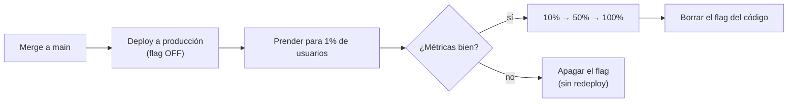
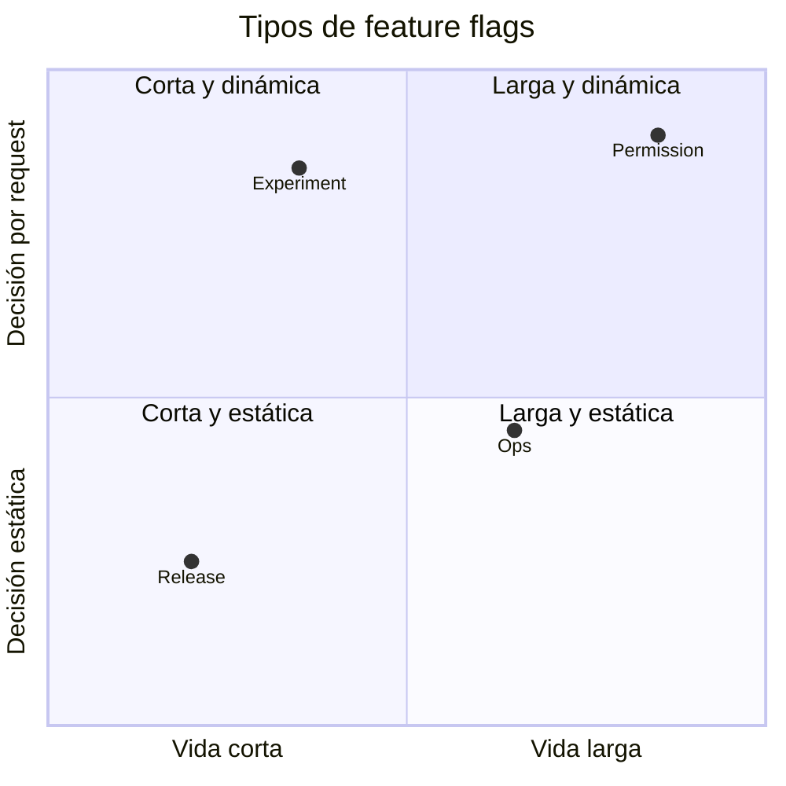
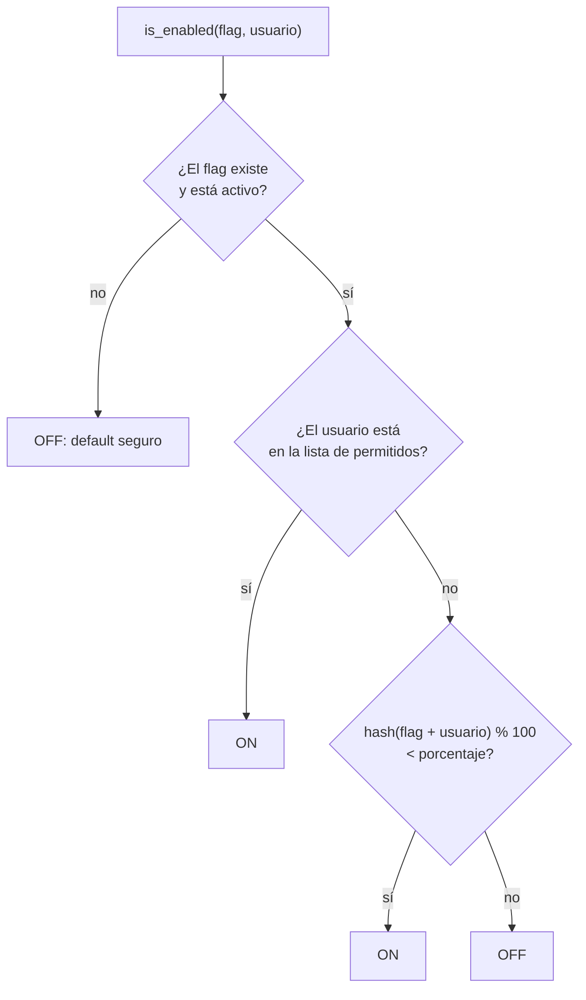

---
aliases:
  - Feature flags
  - Feature toggles
  - Feature switches
tags:
  - devops
  - deployment
  - release
categoria: DevOps
created: 2026-09-27
---

# Feature flags

> [!abstract] Resumen
> Un feature flag es un **condicional en el código cuyo valor se controla desde afuera del código** (un archivo de config, una base de datos o un servicio). Permite prender o apagar una funcionalidad en producción **sin hacer un nuevo deploy**, y elegir para quién se prende.

> [!example] Analogía: la instalación eléctrica
> El electricista deja el cable y la lámpara instalados, pero la luz se prende recién cuando alguien baja el interruptor. El deploy es la instalación; el flag es el interruptor.

## Key points

- [k] Separa **deploy** (subir código) de **release** (que los usuarios lo vean)
- [k] Un rollback pasa a ser apagar un flag: segundos en vez de un redeploy
- [k] Permite prender una funcionalidad para un porcentaje o un grupo de usuarios
- [k] Cada flag es deuda técnica: hay que borrarlo cuando ya no hace falta

## Deploy ≠ release

Sin flags, desplegar y lanzar son lo mismo: si el código está en producción, los usuarios lo ven. Con flags, el código nuevo llega a producción **apagado** y se lanza después, de a poco.



Esto habilita el [[Trunk-based development]]: se puede mergear a `main` código a medio terminar, porque queda escondido detrás de un flag apagado. Nada de ramas que viven semanas y terminan en merges dolorosos.

## Tipos de flags

La clasificación más usada (Pete Hodgson, en martinfowler.com) los separa por **para qué sirven**:

| Tipo | Para qué | Vida útil | Quién lo cambia |
|---|---|---|---|
| **Release** | Esconder código sin terminar o lanzar de a poco | Días o semanas | Devs |
| **Experiment** | [[A-B testing]]: mostrar variantes distintas y medir cuál funciona mejor | Semanas | Producto / data |
| **Ops** | Controlar el sistema en producción. El caso típico es el *kill switch*: apagar algo pesado si el sistema está sobrecargado | Variable, a veces permanente | Ops / SRE |
| **Permission** | Dar acceso a ciertos usuarios (plan premium, beta testers, admins) | Largo plazo | Negocio |

Dos ejes ayudan a ubicarlos: **cuánto viven** y **qué tan dinámica es la decisión** (¿se decide una vez por deploy o en cada request según quién es el usuario?).



> [!tip] Por qué importa el tipo
> Cada tipo se gestiona distinto. Un release flag debería desaparecer en semanas; un permission flag es parte del producto y vive para siempre. Mezclarlos es como terminan los repos con cientos de flags que nadie se anima a borrar.

## Cómo se evalúa un flag

Para decidir si un flag está prendido para un usuario, el sistema recorre reglas en orden:



> [!info] ¿Por qué un hash y no `random()`?
> Con `random()` el mismo usuario vería la funcionalidad nueva en un request y la vieja en el siguiente. El hash del ID del usuario siempre da el mismo número, así que cada usuario cae **siempre en el mismo lado**. Y al incluir el nombre del flag en el hash, no son siempre los mismos usuarios los que prueban todo lo nuevo.

## Ejemplo mínimo (Python)

```python
import hashlib

FLAGS = {
    "nuevo-checkout": {
        "enabled": True,
        "rollout_percentage": 20,
        "allowed_users": {"beta-tester-1"},
    }
}

def bucket(flag_name: str, user_id: str) -> int:
    """Asigna al usuario un número estable entre 0 y 99 para este flag"""
    digest = hashlib.sha256(f"{flag_name}:{user_id}".encode()).hexdigest()
    return int(digest, 16) % 100

def is_enabled(flag_name: str, user_id: str) -> bool:
    flag = FLAGS.get(flag_name)
    if flag is None or not flag["enabled"]:
        return False  # default seguro: si algo falla, queda apagado
    if user_id in flag["allowed_users"]:
        return True
    return bucket(flag_name, user_id) < flag["rollout_percentage"]

def checkout(user_id: str, carrito):
    if is_enabled("nuevo-checkout", user_id):
        return nuevo_checkout(carrito)
    return checkout_actual(carrito)
```

En un sistema real, `FLAGS` no está hardcodeado: vive en una base de datos o en un servicio de flags, y el SDK lo cachea en memoria para no hacer una llamada de red en cada `is_enabled`.

## Herramientas

| Herramienta | Tipo |
|---|---|
| **LaunchDarkly** | SaaS, el más conocido del mercado |
| **Unleash** | Open source, se puede self-hostear |
| **Flagsmith** | Open source + SaaS |
| **GrowthBook** | Open source, enfocado en experimentos (A/B testing) |
| **OpenFeature** | No es una herramienta sino un **estándar** (proyecto de la CNCF): una API común para evaluar flags, con "providers" para cada herramienta. Si cambiás de LaunchDarkly a Unleash, el código de la app no cambia |

## Ventajas y desventajas

- [p] Rollback instantáneo: apagar un flag en vez de revertir y redesplegar
- [p] Lanzamientos progresivos: probar con pocos usuarios antes de exponer a todos
- [p] Permite mergear seguido a `main` sin exponer código incompleto
- [p] Habilita experimentos y acceso por plan o por grupo de usuarios
- [c] Cada flag duplica los caminos posibles del código: con *n* flags hay 2ⁿ combinaciones para testear
- [c] Los flags viejos se acumulan y el código se llena de `if` muertos
- [c] Agrega una dependencia más: si el servicio de flags se cae, la app tiene que saber qué hacer

## Riesgos y buenas prácticas
> [!warning] Flags en el frontend
> Todo lo que llega al navegador el usuario lo puede ver y modificar. Un flag evaluado en el cliente sirve para mostrar u ocultar UI, pero **nunca para controlar permisos**: eso se valida siempre en el backend.

- [i] **Default seguro**: si el servicio de flags no responde, el flag tiene que caer en el comportamiento conocido (casi siempre, apagado)
- [i] **Nombres descriptivos**: `nuevo-checkout-2026` dice más que `flag_17`
- [i] **Dueño y fecha de vencimiento**: cada release flag debería tener un responsable y una fecha para borrarlo
- [i] **Testear las dos ramas**: tanto con el flag prendido como apagado
- [i] **Observabilidad**: registrar qué valor tuvo cada flag en cada request, para poder cruzarlo con errores y métricas ([[Observabilidad]])
- [i] **Borrarlo al terminar**: cuando el rollout llegó al 100% y está estable, se elimina el flag y la rama vieja del código

## Relación con otras estrategias de deploy

Los flags se combinan con, pero no reemplazan a, las estrategias de deploy de infraestructura:

| Estrategia | Qué controla | Nivel |
|---|---|---|
| Feature flag | Qué **funcionalidad** ve cada usuario | Código |
| [[Canary deployment]] | Qué **versión** de la app recibe una parte del tráfico | Infraestructura |
| [[Blue-green deployment]] | Cambiar todo el tráfico de una versión a otra de golpe | Infraestructura |

Un canary deployment prueba una versión entera; un flag prueba una funcionalidad puntual dentro de una versión.
