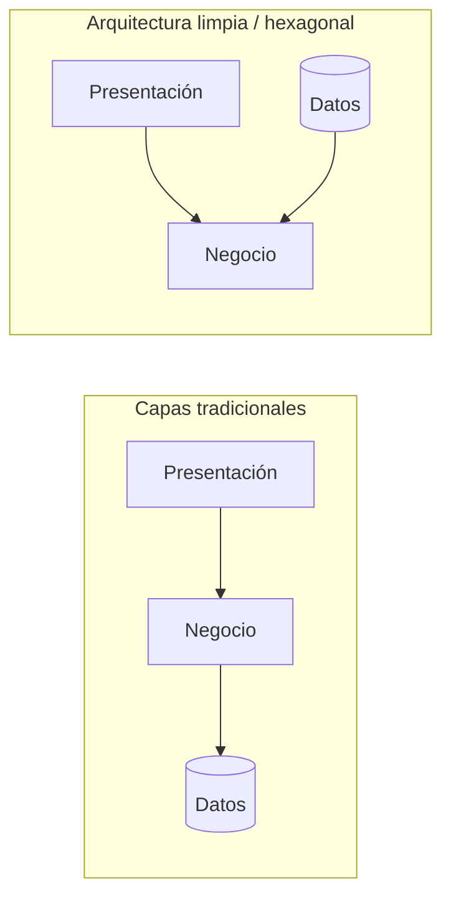
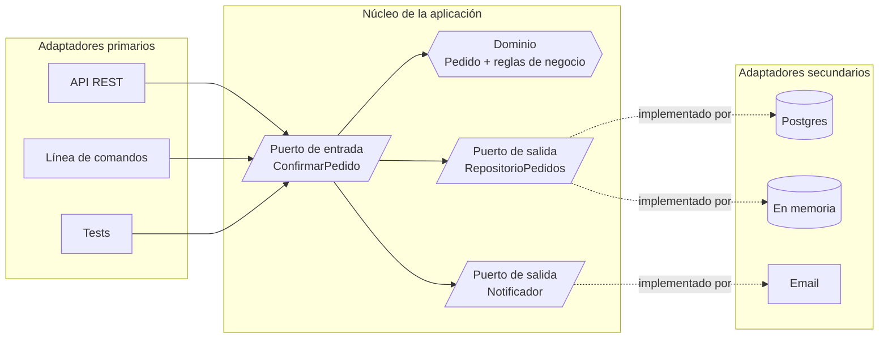
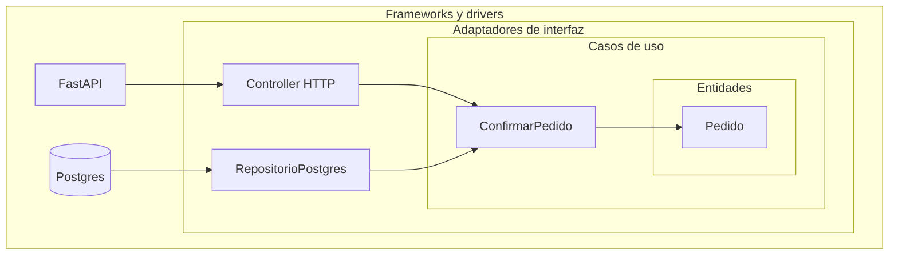
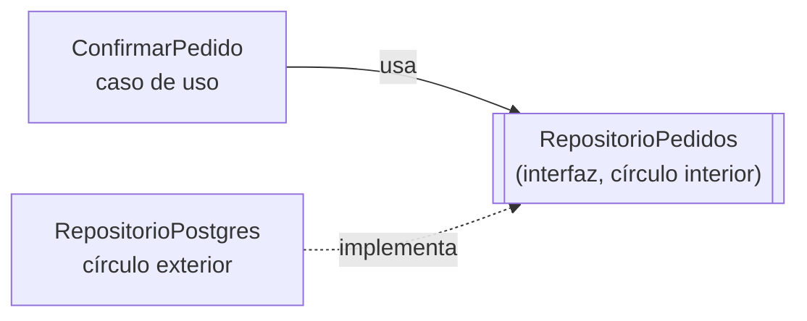
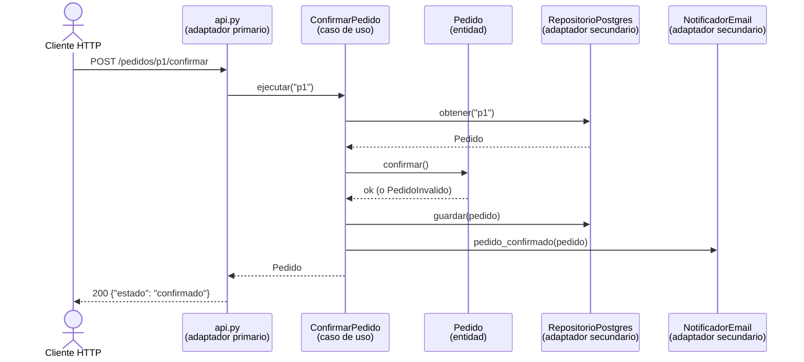

---
aliases:
  - Arquitectura limpia
  - Clean Architecture
  - Arquitectura hexagonal
  - Ports and Adapters
  - Screaming architecture
tags:
  - fundamentos
  - arquitectura
  - diseño
categoria: Fundamentos
created: 2026-10-01
---

# Arquitectura limpia, hexagonal y screaming

> [!abstract] Resumen
> Son tres formas de organizar una aplicación con el mismo objetivo: que **la lógica de negocio no dependa de detalles técnicos** como el framework web, la base de datos o la interfaz. El negocio queda en el centro, y todo lo demás se "enchufa" alrededor.
> - **Hexagonal** (puertos y adaptadores): el núcleo se comunica con el exterior solo a través de interfaces.
> - **Limpia** (Clean Architecture): capas concéntricas donde las dependencias solo apuntan hacia adentro.
> - **Screaming**: la estructura de carpetas tiene que "gritar" de qué trata el negocio, no qué framework se usa.

> [!example] Analogía: una consola de videojuegos
> La consola (el negocio) define sus puertos: HDMI, USB, Bluetooth. No le importa si la conectás a un televisor Samsung o a un monitor LG, ni qué joystick usás, mientras respeten el puerto. Podés cambiar el televisor sin abrir la consola. En una app, el negocio define qué necesita ("guardar un pedido", "avisar al cliente") y cada tecnología se enchufa como un periférico.

## Key points

- [k] **Regla de dependencia**: el código de negocio nunca importa nada de frameworks, bases de datos ni librerías de infraestructura
- [k] El negocio define **interfaces** (puertos) y la infraestructura las **implementa** (adaptadores)
- [k] Hexagonal, Onion y Clean son **la misma idea con distinto vocabulario**; Screaming es complementaria y habla de cómo nombrar y agrupar carpetas
- [k] El beneficio más inmediato: la lógica de negocio se testea **sin base de datos, sin servidor y en milisegundos**
- [k] Es la [[solid#D Dependency Inversion Principle|inversión de dependencias]] de SOLID aplicada a toda la aplicación

## El problema

> [!question] El negocio atrapado en el framework
> En muchas apps, la regla "un pedido vacío no se puede confirmar" vive dentro de un controller de FastAPI, mezclada con la query SQL y el envío del email. Para testearla hace falta levantar el servidor y una base de datos. Para migrar de Flask a FastAPI, o de MySQL a Postgres, hay que reescribir reglas de negocio que no tenían nada que ver con el cambio.

La arquitectura en capas tradicional tiene el problema en la dirección de las flechas:



En el modelo tradicional, **el negocio depende de la capa de datos**: si cambia la base de datos, cambia el negocio. En las arquitecturas limpias, la capa de datos depende del negocio (implementa sus interfaces), y el negocio no depende de nadie.

---

## Arquitectura hexagonal (puertos y adaptadores)

Propuesta por **Alistair Cockburn en 2005**. El hexágono no tiene ningún significado especial: solo es una forma con varios lados para dibujar que la app puede tener muchas entradas y salidas, sin un "arriba" ni un "abajo".



| Pieza | Qué es | Ejemplo |
|---|---|---|
| **Núcleo** | El dominio y los casos de uso. No conoce ninguna tecnología | `Pedido`, `ConfirmarPedido` |
| **Puerto** | Una interfaz definida **por el núcleo**, con sus propias palabras | `RepositorioPedidos.guardar(pedido)` |
| **Adaptador primario** (driving) | Recibe algo del exterior y llama al núcleo | Un endpoint HTTP, un comando de consola, un test |
| **Adaptador secundario** (driven) | Implementa un puerto de salida usando una tecnología concreta | `RepositorioPostgres`, `NotificadorEmail` |

> [!tip] El nombre del adaptador revela la tecnología; el del puerto, no
> El puerto se llama `RepositorioPedidos`, no `PostgresPedidos`: describe **qué necesita el negocio**. La tecnología aparece solo en el nombre del adaptador. Es literalmente el [[patrones-de-diseno#Adapter|patrón Adapter]] aplicado a la frontera de la aplicación.

---

## Arquitectura limpia (Clean Architecture)

Propuesta por **Robert C. Martin** en 2012 y desarrollada en su libro *Clean Architecture* (2017). Unifica hexagonal, Onion Architecture (Jeffrey Palermo, 2008) y otras ideas parecidas en un modelo de **círculos concéntricos**.



Todas las flechas apuntan hacia adentro.

| Capa | Contiene | Cambia cuando... |
|---|---|---|
| **Entidades** | Objetos de negocio y reglas que valen para toda la empresa ("un pedido vacío no se confirma") | Cambian las reglas del negocio en sí |
| **Casos de uso** | Las acciones de la aplicación, que orquestan entidades ("confirmar un pedido") | Cambia lo que la app hace |
| **Adaptadores de interfaz** | Controllers, presenters, implementaciones de repositorios. Traducen entre el formato del negocio y el de la tecnología | Cambia el formato de entrada o salida |
| **Frameworks y drivers** | FastAPI, el driver de Postgres, la UI | Se actualiza o reemplaza una herramienta |

> [!quote] La regla de dependencia
> "Las dependencias del código fuente solo pueden apuntar hacia adentro. Nada en un círculo interior puede saber nada de algo en un círculo exterior." — Robert C. Martin

Y si un caso de uso necesita guardar algo en la base de datos (que está afuera), ¿cómo lo llama sin depender de ella? Con [[solid#D Dependency Inversion Principle|inversión de dependencias]]: el caso de uso define la interfaz `RepositorioPedidos`, y el adaptador de afuera la implementa. En tiempo de ejecución la llamada va hacia afuera, pero **en el código** la dependencia apunta hacia adentro.



> [!warning] No pasar objetos del framework hacia adentro
> Un caso de uso no recibe un `Request` de FastAPI ni devuelve un modelo de SQLAlchemy. Recibe y devuelve datos simples o entidades propias. Si un objeto del framework cruza la frontera, el negocio pasa a depender del framework y se pierde todo el beneficio.

### Hexagonal vs. limpia

Describen la misma estructura:

| Hexagonal | Arquitectura limpia |
|---|---|
| Dominio | Entidades |
| Puertos de entrada / servicios de aplicación | Casos de uso |
| Puertos de salida | Interfaces definidas por los casos de uso |
| Adaptadores primarios y secundarios | Adaptadores de interfaz + frameworks y drivers |

La arquitectura limpia agrega más detalle sobre las capas internas (separa entidades de casos de uso); la hexagonal pone el foco en la simetría entre entradas y salidas.

---

## Screaming architecture

También de **Robert C. Martin** (2011). La pregunta es simple: si alguien mira las carpetas de tu proyecto, ¿qué ve?

> [!quote] La idea
> Los planos de una casa gritan "casa": se ven dormitorios, cocina, baño. Los planos de una biblioteca gritan "biblioteca". La estructura de un proyecto debería gritar de qué trata el negocio, no "soy una app de Django".

**Estructura que grita "framework":**

```text
app/
├── controllers/
│   ├── pedidos_controller.py
│   ├── clientes_controller.py
│   └── productos_controller.py
├── models/
├── services/
└── repositories/
```

Para entender una funcionalidad hay que saltar por cuatro carpetas, y nada dice qué hace la app.

**Estructura que grita "tienda":**

```text
tienda/
├── pedidos/
│   ├── dominio/
│   │   ├── pedido.py              # entidades y reglas de negocio
│   │   └── puertos.py             # interfaces que el dominio necesita
│   ├── aplicacion/
│   │   └── confirmar_pedido.py    # casos de uso
│   └── infraestructura/
│       ├── repositorio_postgres.py
│       ├── notificador_email.py
│       └── api.py                 # adaptador HTTP
├── catalogo/
│   ├── dominio/
│   ├── aplicacion/
│   └── infraestructura/
├── clientes/
│   └── ...
└── main.py                        # composition root: conecta todo
```

- **Primer nivel: el negocio** (pedidos, catálogo, clientes). Es lo primero que se ve.
- **Segundo nivel: las capas** (dominio, aplicación, infraestructura) dentro de cada módulo.
- Todo lo de pedidos está junto: un cambio en pedidos toca una sola carpeta.

> [!info] Screaming complementa a las otras dos
> Hexagonal y limpia dicen **cómo se relacionan las capas**; screaming dice **cómo agrupar y nombrar** el código. Lo habitual es combinarlas: módulos por funcionalidad de negocio y, dentro de cada uno, capas que respetan la regla de dependencia. Esta forma de organizar también se conoce como *package by feature* y conecta con los *bounded contexts* de [[Domain-Driven Design]].

---

## Ejemplo completo en Python

Un caso de uso: **confirmar un pedido**. Reglas de negocio: no se puede confirmar un pedido vacío ni uno que ya está confirmado; al confirmar, se avisa al cliente.

### 1. Dominio: entidades y reglas

```python
# tienda/pedidos/dominio/pedido.py
from dataclasses import dataclass, field
from enum import Enum

class EstadoPedido(Enum):
    PENDIENTE = "pendiente"
    CONFIRMADO = "confirmado"

class PedidoInvalido(Exception):
    pass

@dataclass
class LineaPedido:
    producto: str
    precio: float
    cantidad: int

@dataclass
class Pedido:
    id: str
    cliente_email: str
    lineas: list[LineaPedido] = field(default_factory=list)
    estado: EstadoPedido = EstadoPedido.PENDIENTE

    def total(self) -> float:
        return sum(linea.precio * linea.cantidad for linea in self.lineas)

    def confirmar(self) -> None:
        if not self.lineas:
            raise PedidoInvalido("Un pedido vacío no se puede confirmar")
        if self.estado is not EstadoPedido.PENDIENTE:
            raise PedidoInvalido(f"El pedido ya está {self.estado.value}")
        self.estado = EstadoPedido.CONFIRMADO
```

Ni un solo `import` de frameworks o bases de datos. Las reglas viven en la entidad.

### 2. Puertos: lo que el dominio necesita del exterior

```python
# tienda/pedidos/dominio/puertos.py
from typing import Protocol
from .pedido import Pedido

class RepositorioPedidos(Protocol):
    def obtener(self, pedido_id: str) -> Pedido | None: ...
    def guardar(self, pedido: Pedido) -> None: ...

class Notificador(Protocol):
    def pedido_confirmado(self, pedido: Pedido) -> None: ...
```

### 3. Aplicación: el caso de uso

```python
# tienda/pedidos/aplicacion/confirmar_pedido.py
from ..dominio.pedido import Pedido
from ..dominio.puertos import Notificador, RepositorioPedidos

class PedidoNoEncontrado(Exception):
    pass

class ConfirmarPedido:
    def __init__(self, repo: RepositorioPedidos, notificador: Notificador):
        self._repo = repo
        self._notificador = notificador

    def ejecutar(self, pedido_id: str) -> Pedido:
        pedido = self._repo.obtener(pedido_id)
        if pedido is None:
            raise PedidoNoEncontrado(pedido_id)
        pedido.confirmar()                       # la regla la aplica el dominio
        self._repo.guardar(pedido)
        self._notificador.pedido_confirmado(pedido)
        return pedido
```

El caso de uso **orquesta**: busca, delega la regla al dominio, guarda y notifica. No sabe si el repositorio es Postgres o una lista en memoria.

### 4. Infraestructura: adaptadores secundarios

```python
# tienda/pedidos/infraestructura/repositorio_memoria.py
from ..dominio.pedido import Pedido

class RepositorioEnMemoria:
    def __init__(self):
        self._pedidos: dict[str, Pedido] = {}

    def obtener(self, pedido_id: str) -> Pedido | None:
        return self._pedidos.get(pedido_id)

    def guardar(self, pedido: Pedido) -> None:
        self._pedidos[pedido.id] = pedido
```

```python
# tienda/pedidos/infraestructura/repositorio_postgres.py
import psycopg
from ..dominio.pedido import EstadoPedido, LineaPedido, Pedido

class RepositorioPostgres:
    """Traduce entre filas de la base de datos y entidades del dominio"""
    def __init__(self, dsn: str):
        self._dsn = dsn

    def obtener(self, pedido_id: str) -> Pedido | None:
        with psycopg.connect(self._dsn) as conn:
            fila = conn.execute(
                "SELECT id, cliente_email, estado FROM pedidos WHERE id = %s",
                (pedido_id,),
            ).fetchone()
            if fila is None:
                return None
            lineas = conn.execute(
                "SELECT producto, precio, cantidad FROM lineas_pedido WHERE pedido_id = %s",
                (pedido_id,),
            ).fetchall()
        return Pedido(
            id=fila[0],
            cliente_email=fila[1],
            estado=EstadoPedido(fila[2]),
            lineas=[LineaPedido(*l) for l in lineas],
        )

    def guardar(self, pedido: Pedido) -> None:
        with psycopg.connect(self._dsn) as conn:
            conn.execute(
                "UPDATE pedidos SET estado = %s WHERE id = %s",
                (pedido.estado.value, pedido.id),
            )
```

```python
# tienda/pedidos/infraestructura/notificador_email.py
import smtplib
from email.message import EmailMessage
from ..dominio.pedido import Pedido

class NotificadorEmail:
    def __init__(self, servidor_smtp: str):
        self._servidor = servidor_smtp

    def pedido_confirmado(self, pedido: Pedido) -> None:
        msg = EmailMessage()
        msg["To"] = pedido.cliente_email
        msg["Subject"] = f"Pedido {pedido.id} confirmado"
        msg.set_content(f"Total: ${pedido.total():,.2f}")
        with smtplib.SMTP(self._servidor) as smtp:
            smtp.send_message(msg)
```

### 5. Infraestructura: adaptador primario (HTTP)

```python
# tienda/pedidos/infraestructura/api.py
from fastapi import FastAPI, HTTPException
from ..aplicacion.confirmar_pedido import ConfirmarPedido, PedidoNoEncontrado
from ..dominio.pedido import PedidoInvalido

def crear_api(confirmar_pedido: ConfirmarPedido) -> FastAPI:
    app = FastAPI()

    @app.post("/pedidos/{pedido_id}/confirmar")
    def confirmar(pedido_id: str):
        try:
            pedido = confirmar_pedido.ejecutar(pedido_id)
        except PedidoNoEncontrado:
            raise HTTPException(status_code=404, detail="Pedido no encontrado")
        except PedidoInvalido as e:
            raise HTTPException(status_code=409, detail=str(e))
        return {"id": pedido.id, "estado": pedido.estado.value, "total": pedido.total()}

    return app
```

El controller solo **traduce**: de HTTP a una llamada al caso de uso, y de excepciones de negocio a códigos de estado HTTP. No tiene reglas de negocio.

### 6. Composition root: conectar todo

```python
# tienda/main.py
import os
from tienda.pedidos.aplicacion.confirmar_pedido import ConfirmarPedido
from tienda.pedidos.infraestructura.api import crear_api
from tienda.pedidos.infraestructura.notificador_email import NotificadorEmail
from tienda.pedidos.infraestructura.repositorio_postgres import RepositorioPostgres

confirmar_pedido = ConfirmarPedido(
    repo=RepositorioPostgres(os.environ["DATABASE_URL"]),
    notificador=NotificadorEmail(os.environ["SMTP_HOST"]),
)
app = crear_api(confirmar_pedido)
```

> [!info] Composition root
> Es el **único lugar** del programa que conoce todas las piezas concretas y las conecta (a mano o con un framework de [[Inyección de dependencias]]). Cambiar Postgres por otra base de datos es cambiar una línea acá; el dominio y los casos de uso no se enteran.

### 7. Tests: el beneficio inmediato

```python
# tests/test_confirmar_pedido.py
import pytest
from tienda.pedidos.aplicacion.confirmar_pedido import ConfirmarPedido, PedidoNoEncontrado
from tienda.pedidos.dominio.pedido import EstadoPedido, LineaPedido, Pedido, PedidoInvalido
from tienda.pedidos.infraestructura.repositorio_memoria import RepositorioEnMemoria

class NotificadorFalso:
    def __init__(self):
        self.notificados: list[str] = []

    def pedido_confirmado(self, pedido: Pedido) -> None:
        self.notificados.append(pedido.id)

@pytest.fixture
def repo():
    repo = RepositorioEnMemoria()
    repo.guardar(Pedido("p1", "ana@mail.com", [LineaPedido("Pack de pinceles", 2500, 2)]))
    repo.guardar(Pedido("vacio", "juan@mail.com"))
    return repo

def test_confirma_el_pedido_y_avisa_al_cliente(repo):
    notificador = NotificadorFalso()
    ConfirmarPedido(repo, notificador).ejecutar("p1")
    assert repo.obtener("p1").estado is EstadoPedido.CONFIRMADO
    assert notificador.notificados == ["p1"]

def test_no_confirma_un_pedido_vacio(repo):
    notificador = NotificadorFalso()
    with pytest.raises(PedidoInvalido):
        ConfirmarPedido(repo, notificador).ejecutar("vacio")
    assert notificador.notificados == []

def test_pedido_inexistente(repo):
    with pytest.raises(PedidoNoEncontrado):
        ConfirmarPedido(repo, NotificadorFalso()).ejecutar("no-existe")
```

Estos tests no levantan un servidor, no necesitan Postgres ni un servidor de email, y corren en milisegundos. El adaptador en memoria y el notificador falso **se enchufan en los mismos puertos** que los reales.

### El recorrido de un request



---

## Comparación

| | Hexagonal | Onion | Limpia | Screaming |
|---|---|---|---|---|
| Autor y año | Alistair Cockburn, 2005 | Jeffrey Palermo, 2008 | Robert C. Martin, 2012 | Robert C. Martin, 2011 |
| Idea central | El núcleo habla con el exterior solo por puertos | Capas concéntricas alrededor del modelo de dominio | Capas concéntricas con la regla de dependencia | Las carpetas reflejan el negocio |
| Vocabulario | Puertos, adaptadores, primario/secundario | Dominio, servicios de dominio, servicios de aplicación | Entidades, casos de uso, adaptadores, frameworks | Módulos por funcionalidad |
| Qué aporta | Simetría entre entradas y salidas | Énfasis en el modelo de dominio | Más detalle en las capas internas | Organización y legibilidad del proyecto |

## Cuándo usarla y cuándo no

- [p] Lógica de negocio testeable sin infraestructura
- [p] Cambiar de framework, base de datos o proveedor de email no toca el negocio
- [p] Se pueden posponer decisiones técnicas: arrancar con un repositorio en memoria y elegir la base de datos después
- [p] El código se entiende por lo que hace el negocio, no por la tecnología
- [c] Más archivos, interfaces y traducciones entre capas (mappers) que en una app sencilla
- [c] Curva de aprendizaje para el equipo
- [c] En un CRUD sin reglas de negocio es **ceremonia sin beneficio**: los casos de uso terminan siendo "llamá al repositorio"

> [!tip] Cuándo vale la pena
> Cuanto más **lógica de negocio propia** tiene la app y más tiempo va a vivir, más conviene. Para un prototipo, un script o un CRUD administrativo, un framework con sus convenciones (Django, Rails) es más productivo. Una salida intermedia: separar al menos el dominio en módulos sin imports de framework, y agregar puertos solo donde haya algo que cambiar o testear.

## Errores comunes

> [!warning] Dominio anémico
> Entidades que son solo bolsas de datos (getters y setters) y toda la lógica metida en los casos de uso. Las reglas que pertenecen a un concepto del negocio van **en la entidad**: en el ejemplo, `Pedido.confirmar()` es quien sabe que un pedido vacío no se confirma.

- [c] Que el dominio importe algo del ORM (por ejemplo, entidades que heredan de un modelo de SQLAlchemy o de Django): la regla de dependencia queda rota
- [c] Crear una interfaz para cada clase "por las dudas", incluso para cosas que nunca van a tener otra implementación
- [c] Organizar todo por capas técnicas (`controllers/`, `services/`) y llamarlo arquitectura limpia: las capas existen, pero el proyecto no "grita" nada
- [c] Dejar que los casos de uso devuelvan objetos del framework (un `Response`, un modelo del ORM)
- [i] La arquitectura no se mide por la cantidad de carpetas, sino por una pregunta: **¿puedo testear y cambiar el negocio sin tocar la infraestructura?**
