---
aliases:
  - Patrones de diseño
  - Design patterns
  - GoF
tags:
  - fundamentos
  - diseño
  - poo
categoria: Fundamentos
created: 2026-09-28
---

# Patrones de diseño

> [!abstract] Resumen
> Un patrón de diseño es una **solución probada a un problema de diseño que se repite**.
## Key points

- [k] Resuelven problemas **recurrentes**; si el problema no existe, el patrón sobra
- [k] Se dividen en tres familias: **creacionales**, **estructurales** y **de comportamiento**
- [k] Casi todos aplican la misma idea: **programar contra interfaces, no contra implementaciones**, y **preferir composición sobre herencia**
- [k] En lenguajes como Python, varios patrones se simplifican mucho porque las funciones son objetos

## Las tres familias

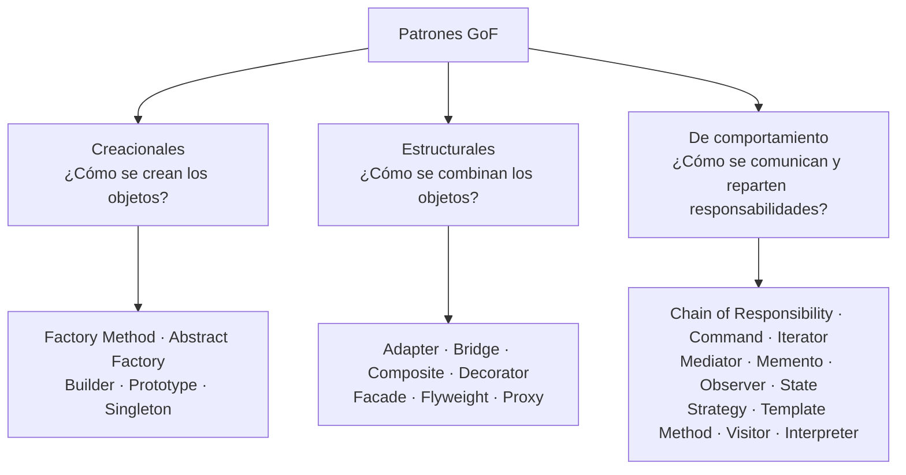

| Patrón | Familia | Idea en una línea |
|---|---|---|
| **Factory Method** | Creacional | Una subclase o función decide qué clase concreta instanciar |
| Abstract Factory | Creacional | Crea familias de objetos relacionados (ej. todos los widgets de un tema) |
| **Builder** | Creacional | Arma un objeto complejo paso a paso |
| Prototype | Creacional | Crea objetos clonando uno existente |
| **Singleton** | Creacional | Garantiza una sola instancia global |
| **Adapter** | Estructural | Hace compatible una interfaz con otra |
| Bridge | Estructural | Separa una abstracción de su implementación para que varíen por separado |
| Composite | Estructural | Trata igual a un objeto y a un grupo de objetos (árboles) |
| **Decorator** | Estructural | Agrega comportamiento envolviendo un objeto |
| **Facade** | Estructural | Una interfaz simple frente a un subsistema complejo |
| Flyweight | Estructural | Comparte estado entre muchos objetos para ahorrar memoria |
| Proxy | Estructural | Un intermediario que controla el acceso a otro objeto |
| Chain of Responsibility | Comportamiento | Pasa un pedido por una cadena hasta que alguien lo maneja |
| **Command** | Comportamiento | Convierte una acción en un objeto (permite deshacer, encolar) |
| Iterator | Comportamiento | Recorre una colección sin exponer su estructura |
| Mediator | Comportamiento | Centraliza la comunicación entre objetos |
| Memento | Comportamiento | Guarda y restaura el estado de un objeto |
| **Observer** | Comportamiento | Notifica a suscriptores cuando algo cambia |
| **State** | Comportamiento | El objeto cambia de comportamiento según su estado interno |
| **Strategy** | Comportamiento | Algoritmos intercambiables detrás de una misma interfaz |
| Template Method | Comportamiento | Define el esqueleto de un algoritmo; las subclases completan pasos |
| Visitor | Comportamiento | Agrega operaciones a una estructura sin modificar sus clases |
| Interpreter | Comportamiento | Evalúa sentencias de un lenguaje simple |

Los que están en **negrita** son los más usados en el día a día y están desarrollados abajo.

---

## Creacionales

### Factory Method

> [!question] Problema
> El código necesita crear objetos, pero no debería depender de **qué clase concreta** crea. Ej: una app que exporta imágenes en PNG, JPG o SVG, y el formato lo elige el usuario.

**Solución:** delegar la creación a un método o función "fábrica" que devuelve algo que cumple una interfaz común.

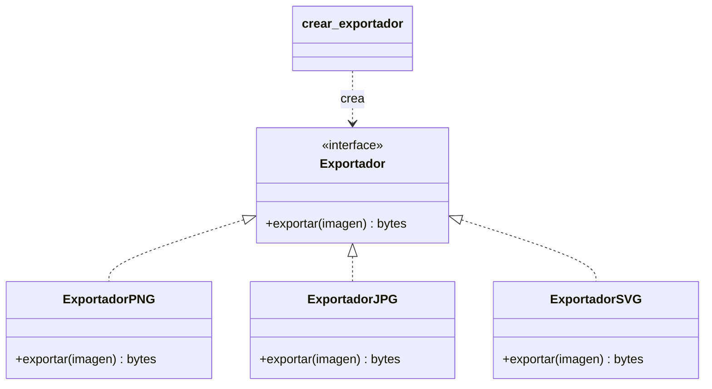

```python
from typing import Protocol

class Exportador(Protocol):
    def exportar(self, imagen: str) -> bytes: ...

class ExportadorPNG:
    def exportar(self, imagen: str) -> bytes:
        return f"PNG({imagen})".encode()

class ExportadorJPG:
    def exportar(self, imagen: str) -> bytes:
        return f"JPG({imagen})".encode()

class ExportadorSVG:
    def exportar(self, imagen: str) -> bytes:
        return f"SVG({imagen})".encode()

EXPORTADORES = {"png": ExportadorPNG, "jpg": ExportadorJPG, "svg": ExportadorSVG}

def crear_exportador(formato: str) -> Exportador:
    try:
        return EXPORTADORES[formato]()
    except KeyError:
        raise ValueError(f"Formato no soportado: {formato}")

# El código cliente no sabe (ni le importa) qué clase concreta recibe
exportador = crear_exportador("png")
print(exportador.exportar("dibujo"))  # b'PNG(dibujo)'
```

- [p] Agregar un formato nuevo = una clase nueva + una línea en el diccionario
- [c] Para dos o tres casos que nunca cambian, un `if` es más simple

### Builder

> [!question] Problema
> Un objeto tiene muchos parámetros opcionales y el constructor se vuelve ilegible: `Request("GET", url, None, None, 30, True, False, ...)`.

**Solución:** un objeto aparte que arma el resultado paso a paso, con métodos que se pueden encadenar.

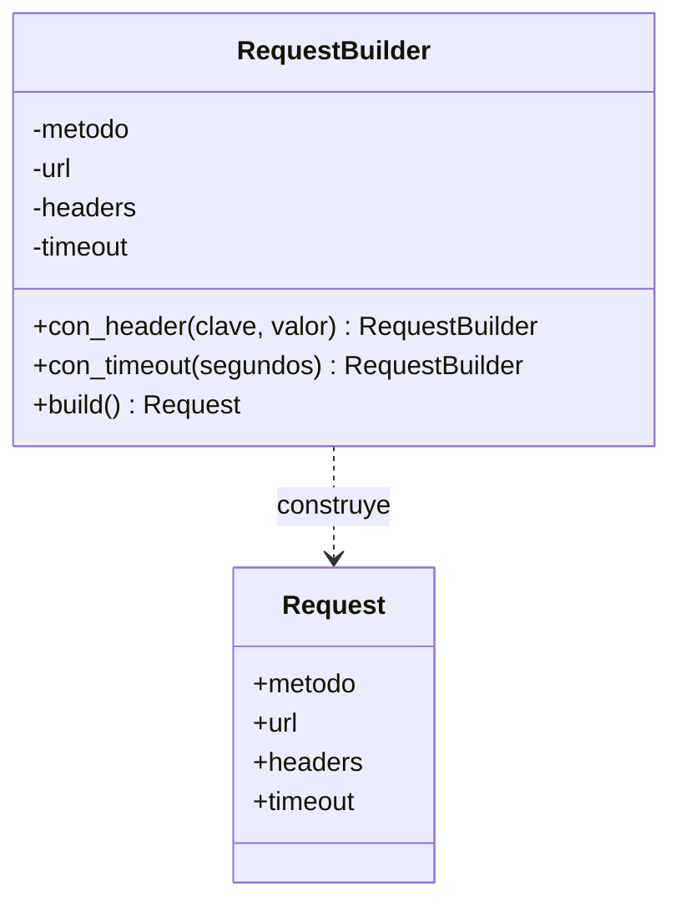

```python
from dataclasses import dataclass, field

@dataclass(frozen=True)
class Request:
    metodo: str
    url: str
    headers: dict = field(default_factory=dict)
    timeout: int = 30

class RequestBuilder:
    def __init__(self, metodo: str, url: str):
        self._metodo = metodo
        self._url = url
        self._headers = {}
        self._timeout = 30

    def con_header(self, clave: str, valor: str) -> "RequestBuilder":
        self._headers[clave] = valor
        return self  # devolver self permite encadenar

    def con_timeout(self, segundos: int) -> "RequestBuilder":
        self._timeout = segundos
        return self

    def build(self) -> Request:
        return Request(self._metodo, self._url, self._headers, self._timeout)

req = (
    RequestBuilder("GET", "https://api.ejemplo.com")
    .con_header("Authorization", "Bearer abc")
    .con_timeout(10)
    .build()
)
print(req)
```

> [!tip] En Python muchas veces no hace falta
> Los argumentos con nombre y valores por defecto (`Request("GET", url, timeout=10)`) ya resuelven gran parte del problema. El Builder vale la pena cuando la construcción tiene **pasos con lógica** o validaciones entre campos. Un ejemplo real: los query builders de los ORMs (`query.filter(...).order_by(...).limit(10)`).

### Singleton

> [!question] Problema
> Tiene que existir **una sola instancia** de algo en toda la app: la configuración, un pool de conexiones a la base de datos, un logger.

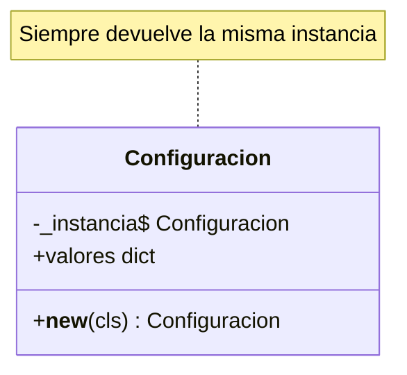

```python
class Configuracion:
    _instancia = None

    def __new__(cls):
        if cls._instancia is None:
            cls._instancia = super().__new__(cls)
            cls._instancia.valores = {"modo": "produccion"}
        return cls._instancia

a = Configuracion()
b = Configuracion()
print(a is b)  # True
```

> [!warning] El patrón más criticado
> Un Singleton es una **variable global disfrazada**. Esconde dependencias (cualquier parte del código puede usarlo sin declararlo), dificulta los tests (el estado sobrevive entre un test y otro) y trae problemas con hilos. La alternativa habitual es crear una sola instancia al arrancar la app y **pasarla como parámetro** a quien la necesite ([[Inyección de dependencias]]).

> [!info] La forma pythonica
> Los módulos de Python ya son singletons: se ejecutan una sola vez y todos los `import` reciben el mismo objeto. Un `config.py` con una instancia a nivel de módulo resuelve el problema sin ninguna clase especial.

---

## Estructurales

### Adapter

> [!question] Problema
> Tenés código que espera una interfaz, y una librería (o un sistema viejo) que ofrece otra. No podés cambiar ninguno de los dos.

**Solución:** una clase intermedia que traduce una interfaz a la otra. Como un adaptador de enchufe.

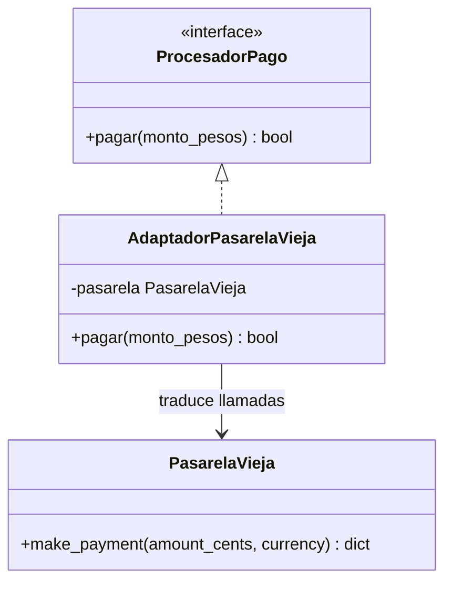

```python
class PasarelaVieja:
    """Librería de terceros: no se puede modificar"""
    def make_payment(self, amount_cents: int, currency: str) -> dict:
        return {"status": "ok", "charged": amount_cents, "currency": currency}

class AdaptadorPasarelaVieja:
    """Expone la interfaz que espera nuestro código: pagar(monto_pesos) -> bool"""
    def __init__(self, pasarela: PasarelaVieja):
        self._pasarela = pasarela

    def pagar(self, monto_pesos: float) -> bool:
        respuesta = self._pasarela.make_payment(int(monto_pesos * 100), "ARS")
        return respuesta["status"] == "ok"

procesador = AdaptadorPasarelaVieja(PasarelaVieja())
print(procesador.pagar(1500.50))  # True
```

- [p] Aísla la dependencia externa: si mañana cambia la pasarela, solo cambia el adaptador
- [i] Muy común al integrar APIs de terceros o al migrar sistemas legacy

### Decorator

> [!question] Problema
> Querés agregarle comportamiento a un objeto (logs, caché, compresión, reintentos) **sin modificar su clase** y pudiendo combinar extras libremente. Con herencia terminarías con `NotificadorConLogYReintentosYCache`.

**Solución:** un objeto que envuelve a otro con la misma interfaz, hace algo extra y delega el resto.

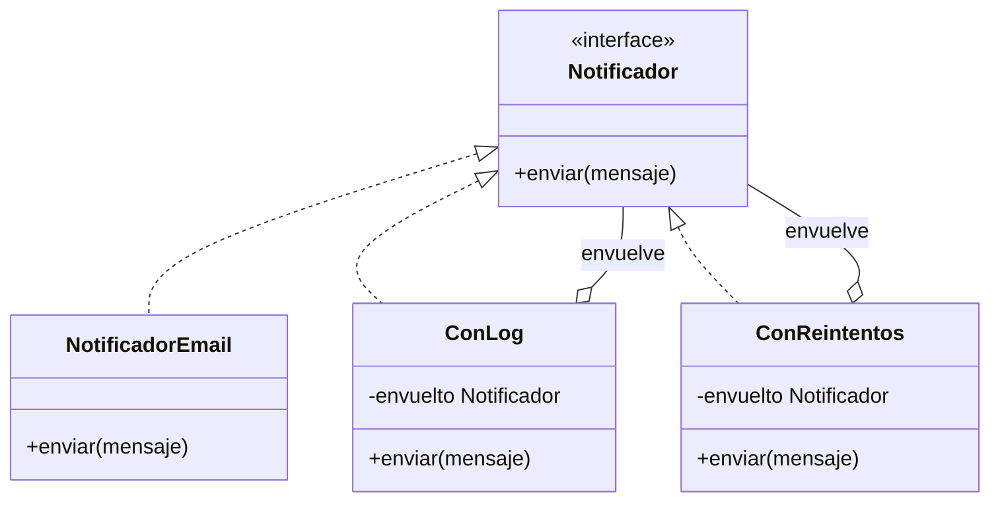

```python
class NotificadorEmail:
    def enviar(self, mensaje: str) -> None:
        print(f"Email enviado: {mensaje}")

class ConLog:
    def __init__(self, envuelto):
        self._envuelto = envuelto

    def enviar(self, mensaje: str) -> None:
        print(f"[log] enviando '{mensaje}'")
        self._envuelto.enviar(mensaje)

class ConReintentos:
    def __init__(self, envuelto, intentos: int = 3):
        self._envuelto = envuelto
        self._intentos = intentos

    def enviar(self, mensaje: str) -> None:
        for intento in range(1, self._intentos + 1):
            try:
                return self._envuelto.enviar(mensaje)
            except ConnectionError:
                print(f"Falló el intento {intento}")
        raise ConnectionError("Se agotaron los reintentos")

# Las capas se combinan como se quiera, en cualquier orden
notificador = ConLog(ConReintentos(NotificadorEmail()))
notificador.enviar("Tu pedido fue despachado")
```

> [!info] ¿Y los `@decoradores` de Python?
> Son la misma idea aplicada a **funciones**: `@lru_cache` o `@retry` envuelven una función y le agregan comportamiento sin tocar su código. El patrón GoF hace lo mismo con **objetos**.

### Facade

> [!question] Problema
> Para hacer algo común hay que coordinar varias clases de un subsistema, en el orden correcto. Ej: publicar una imagen implica redimensionarla, comprimirla, ponerle marca de agua y subirla.

**Solución:** una clase con un método simple que hace toda la coordinación por detrás.

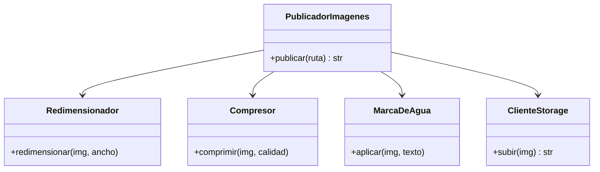

```python
class Redimensionador:
    def redimensionar(self, img: str, ancho: int) -> str:
        return f"{img}@{ancho}px"

class Compresor:
    def comprimir(self, img: str, calidad: int) -> str:
        return f"{img}(q{calidad})"

class MarcaDeAgua:
    def aplicar(self, img: str, texto: str) -> str:
        return f"{img}+'{texto}'"

class ClienteStorage:
    def subir(self, img: str) -> str:
        return f"https://cdn.ejemplo.com/{abs(hash(img))}"

class PublicadorImagenes:
    """Facade: una sola llamada en vez de coordinar cuatro clases"""
    def __init__(self):
        self._redim = Redimensionador()
        self._compresor = Compresor()
        self._marca = MarcaDeAgua()
        self._storage = ClienteStorage()

    def publicar(self, ruta: str) -> str:
        img = self._redim.redimensionar(ruta, ancho=1200)
        img = self._compresor.comprimir(img, calidad=85)
        img = self._marca.aplicar(img, "© mi portfolio")
        return self._storage.subir(img)

print(PublicadorImagenes().publicar("ilustracion.png"))
```

- [p] El código cliente queda simple y no depende de los detalles del subsistema
- [c] Si la facade empieza a hacer de todo, se convierte en un "god object"
- [i] Las clases del subsistema siguen disponibles para quien necesite control fino

---

## De comportamiento

### Strategy

> [!question] Problema
> Hay varias formas de hacer lo mismo (calcular un envío, ordenar una lista, comprimir un archivo) y el código está lleno de `if tipo == "a": ... elif tipo == "b": ...`. Cada opción nueva obliga a modificar esa función.

**Solución:** cada algoritmo va en su propia clase con una interfaz común, y el objeto que lo usa recibe la estrategia desde afuera.

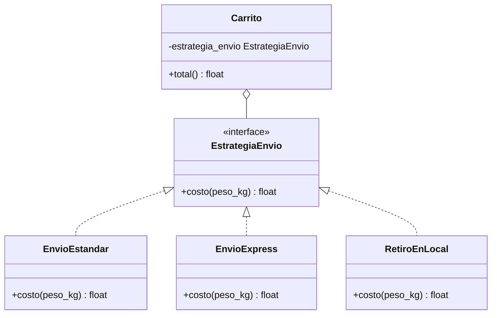

```python
from typing import Callable

# Versión clásica: una clase por estrategia
class EnvioEstandar:
    def costo(self, peso_kg: float) -> float:
        return 500 + 100 * peso_kg

class EnvioExpress:
    def costo(self, peso_kg: float) -> float:
        return 1200 + 250 * peso_kg

class RetiroEnLocal:
    def costo(self, peso_kg: float) -> float:
        return 0

class Carrito:
    def __init__(self, subtotal: float, peso_kg: float, estrategia_envio):
        self.subtotal = subtotal
        self.peso_kg = peso_kg
        self.estrategia_envio = estrategia_envio

    def total(self) -> float:
        return self.subtotal + self.estrategia_envio.costo(self.peso_kg)

print(Carrito(10_000, 2, EnvioExpress()).total())  # 11700

# Versión pythonica: si la estrategia es una sola función, no hace falta una clase
def envio_estandar(peso_kg: float) -> float:
    return 500 + 100 * peso_kg

def total(subtotal: float, peso_kg: float, costo_envio: Callable[[float], float]) -> float:
    return subtotal + costo_envio(peso_kg)

print(total(10_000, 2, envio_estandar))  # 10700
```

- [p] Agregar una estrategia no toca el código existente (principio abierto/cerrado de [[SOLID]])
- [p] Cada estrategia se testea por separado
- [c] El código cliente tiene que conocer las estrategias para elegir una

> [!tip] Strategy vs. State
> Tienen el mismo diagrama. La diferencia es **quién cambia la pieza**: en Strategy la elige el cliente desde afuera; en State el propio objeto la cambia solo cuando su estado cambia.

### Observer

> [!question] Problema
> Cuando pasa algo en un objeto (se crea un pedido, cambia un precio), varias partes del sistema tienen que enterarse: mandar un email, actualizar el stock, registrar métricas. Si el objeto las llama a todas directamente, queda acoplado a cada una.

**Solución:** el objeto (el *sujeto*) mantiene una lista de suscriptores y les avisa cuando algo cambia, sin saber quiénes son.

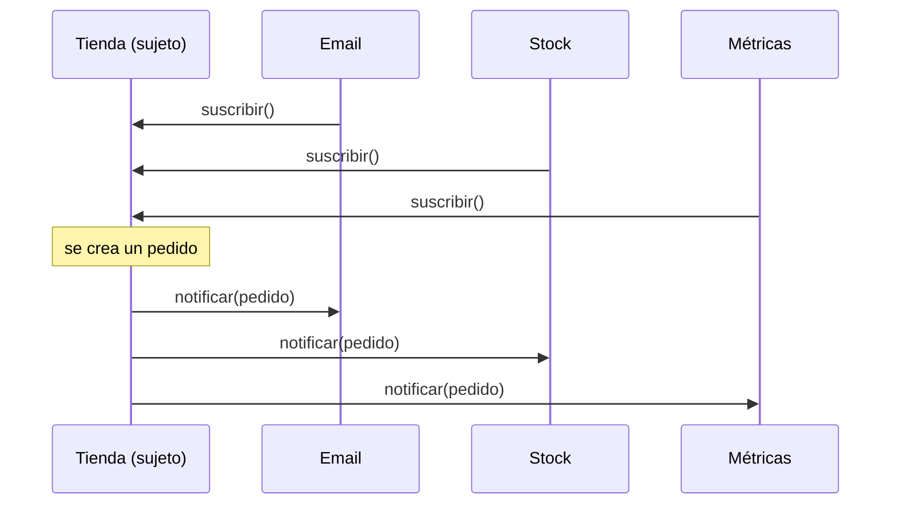

```python
from collections import defaultdict
from typing import Callable

class EventBus:
    def __init__(self):
        self._suscriptores: dict[str, list[Callable]] = defaultdict(list)

    def suscribir(self, evento: str, callback: Callable) -> None:
        self._suscriptores[evento].append(callback)

    def publicar(self, evento: str, datos) -> None:
        for callback in self._suscriptores[evento]:
            callback(datos)

bus = EventBus()
bus.suscribir("pedido_creado", lambda p: print(f"Email de confirmación para {p['cliente']}"))
bus.suscribir("pedido_creado", lambda p: print(f"Descontando stock de {p['producto']}"))

bus.publicar("pedido_creado", {"cliente": "ana@mail.com", "producto": "pack de pinceles"})
```

- [p] Agregar una reacción nueva = una suscripción nueva; el sujeto no cambia
- [c] El flujo es más difícil de seguir: no se ve en el código quién reacciona a qué
- [c] Si un suscriptor se olvida de desuscribirse, puede quedar vivo en memoria
- [i] Es la base de los eventos del DOM (`addEventListener`), de la reactividad en frameworks de frontend y, a escala de sistemas, de la [[Event-driven architecture]]

### Command

> [!question] Problema
> Querés poder **deshacer** acciones, guardarlas en un historial, encolarlas o ejecutarlas más tarde. Si cada acción es una llamada directa a un método, no hay nada que guardar.

**Solución:** cada acción se convierte en un objeto con `ejecutar()` y `deshacer()`. Así funciona el Ctrl+Z de cualquier editor.

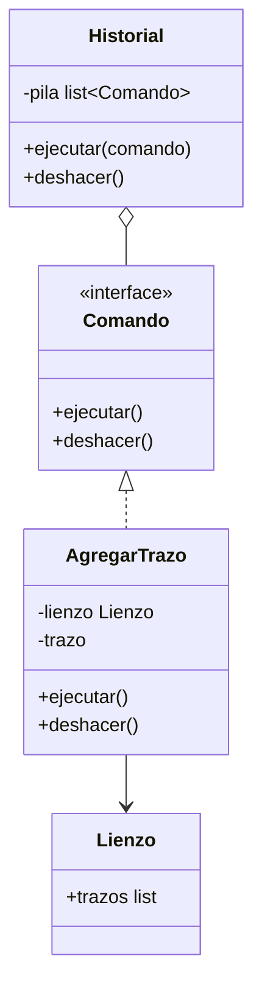

```python
class Lienzo:
    def __init__(self):
        self.trazos: list[str] = []

class AgregarTrazo:
    def __init__(self, lienzo: Lienzo, trazo: str):
        self._lienzo = lienzo
        self._trazo = trazo

    def ejecutar(self) -> None:
        self._lienzo.trazos.append(self._trazo)

    def deshacer(self) -> None:
        self._lienzo.trazos.remove(self._trazo)

class Historial:
    def __init__(self):
        self._pila = []

    def ejecutar(self, comando) -> None:
        comando.ejecutar()
        self._pila.append(comando)

    def deshacer(self) -> None:
        if self._pila:
            self._pila.pop().deshacer()

lienzo = Lienzo()
historial = Historial()
historial.ejecutar(AgregarTrazo(lienzo, "línea azul"))
historial.ejecutar(AgregarTrazo(lienzo, "círculo rojo"))
print(lienzo.trazos)  # ['línea azul', 'círculo rojo']
historial.deshacer()   # Ctrl+Z
print(lienzo.trazos)  # ['línea azul']
```

- [p] Deshacer/rehacer, historial, macros (una lista de comandos) y colas de tareas
- [i] Las colas de trabajos en segundo plano (Celery, Sidekiq) aplican la misma idea: la tarea es un objeto que se guarda y se ejecuta después

### State

> [!question] Problema
> Un objeto se comporta distinto según su estado, y cada método está lleno de `if estado == ...`. Ej: un pedido que puede estar pendiente, pagado, enviado o cancelado, donde cada acción es válida solo en algunos estados.

**Solución:** cada estado es una clase que implementa las acciones a su manera y decide a qué estado se pasa.

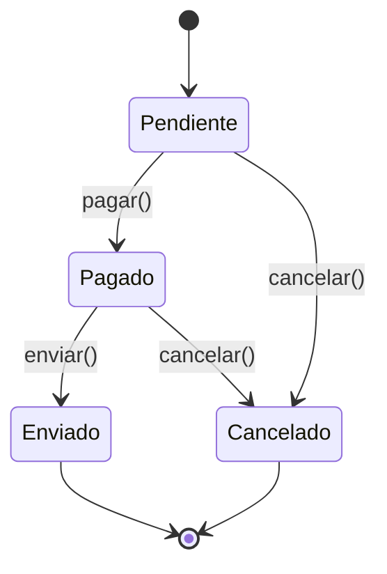

```python
class EstadoPedido:
    def pagar(self, pedido): raise ValueError(f"No se puede pagar un pedido {self}")
    def enviar(self, pedido): raise ValueError(f"No se puede enviar un pedido {self}")
    def cancelar(self, pedido): raise ValueError(f"No se puede cancelar un pedido {self}")
    def __str__(self): return type(self).__name__.lower()

class Pendiente(EstadoPedido):
    def pagar(self, pedido): pedido.estado = Pagado()
    def cancelar(self, pedido): pedido.estado = Cancelado()

class Pagado(EstadoPedido):
    def enviar(self, pedido): pedido.estado = Enviado()
    def cancelar(self, pedido): pedido.estado = Cancelado()

class Enviado(EstadoPedido): pass
class Cancelado(EstadoPedido): pass

class Pedido:
    def __init__(self):
        self.estado: EstadoPedido = Pendiente()

    def pagar(self): self.estado.pagar(self)
    def enviar(self): self.estado.enviar(self)
    def cancelar(self): self.estado.cancelar(self)

pedido = Pedido()
pedido.pagar()
pedido.enviar()
print(pedido.estado)  # enviado
try:
    pedido.cancelar()
except ValueError as e:
    print(e)  # No se puede cancelar un pedido enviado
```

- [p] Las transiciones válidas quedan explícitas y en un solo lugar por estado
- [c] Para dos estados simples, un booleano y un `if` alcanzan

---

## ¿Cuál uso?

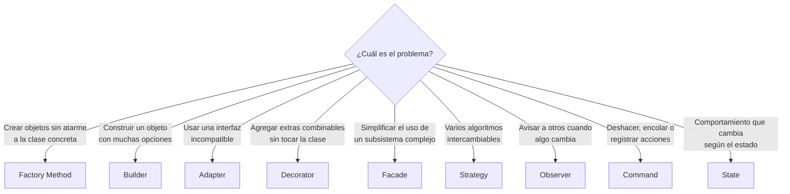

## Errores comunes

> [!warning] Patternitis
> Aplicar patrones "porque sí" es tan malo como no conocerlos. Una Factory con un solo producto o un Strategy con una sola estrategia es complejidad sin beneficio. Los patrones suelen aparecer **al hacer [[Refactoring]]**, cuando el problema ya existe, no antes.

- [c] Usar Singleton como atajo para tener variables globales
- [c] Copiar la implementación de Java tal cual en Python, en vez de usar funciones, módulos y decoradores del lenguaje
- [c] Nombrar clases con el patrón (`UserManagerFactoryStrategy`) en vez de con lo que hacen en el dominio
- [i] Conocer los patrones sirve igual aunque no los apliques: te ayuda a **reconocerlos** en frameworks y librerías (los middlewares de Express son Chain of Responsibility; los `signals` de Django, Observer; los ORMs, Builder)

## Relación con otros principios

Los patrones son aplicaciones concretas de principios más generales como [[SOLID]]: Strategy y Decorator aplican el principio abierto/cerrado; Adapter y Facade reducen el acoplamiento; y casi todos dependen de abstracciones en lugar de clases concretas (inversión de dependencias). A nivel de sistema completo, las mismas ideas reaparecen en la [[Arquitectura limpia]].
