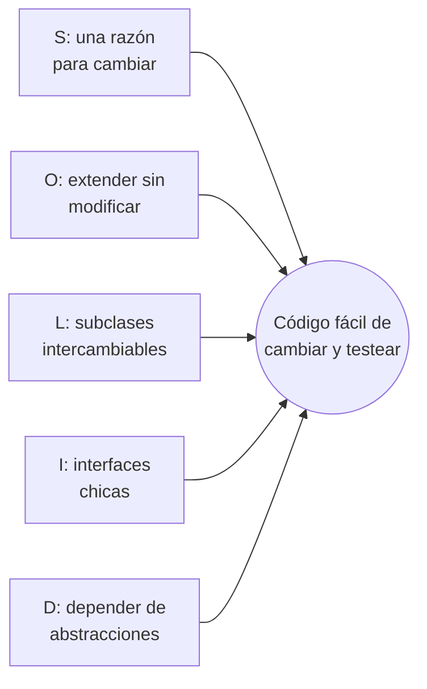
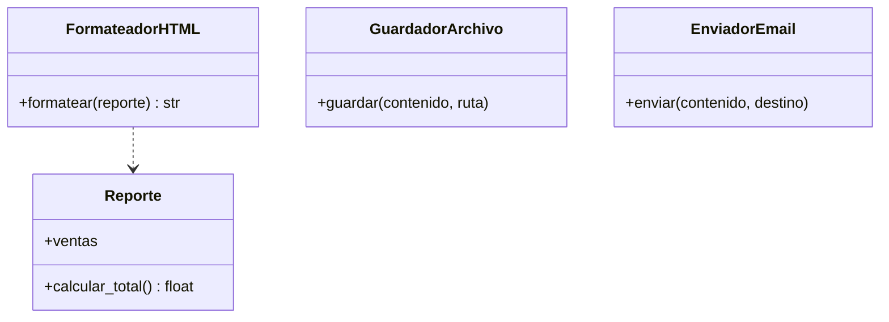
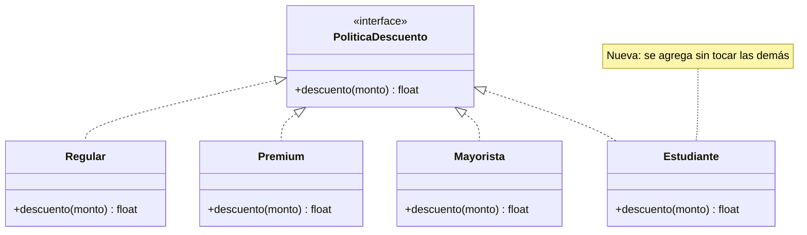
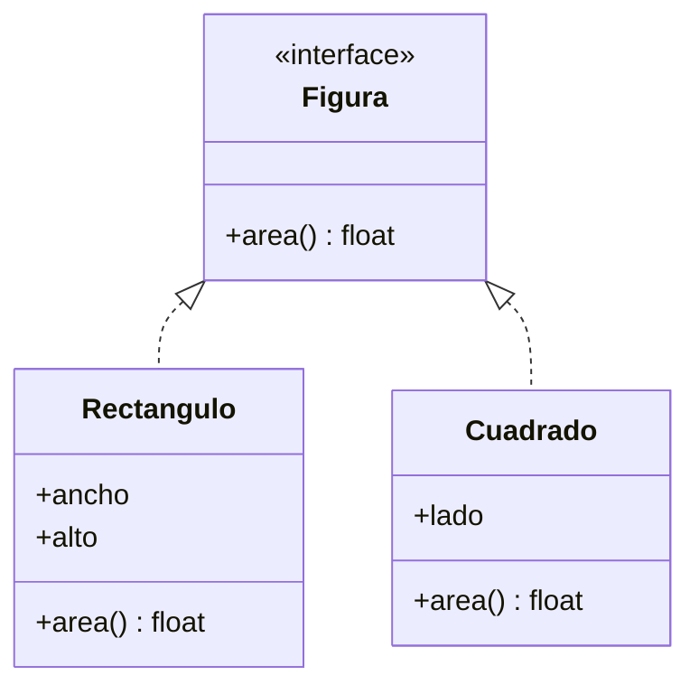
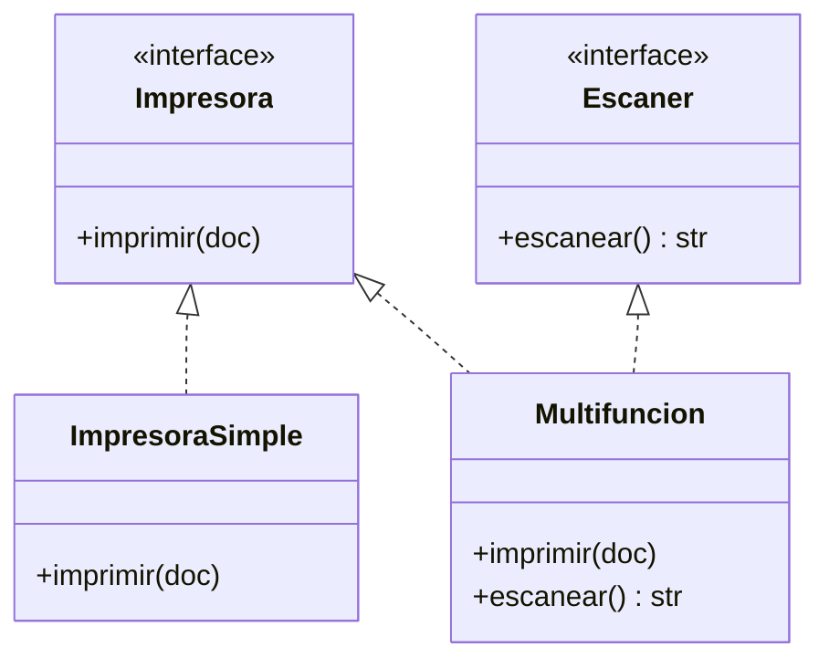
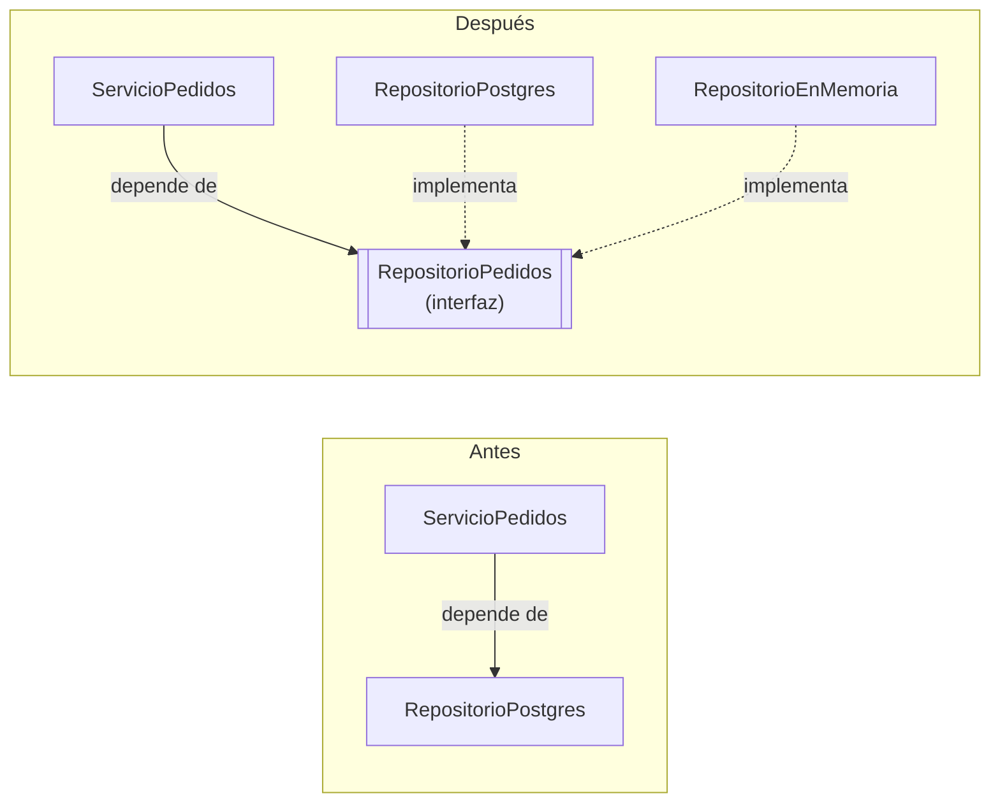

---
aliases:
  - SOLID
  - Principios SOLID
tags:
  - fundamentos
  - diseño
  - poo
categoria: Fundamentos
created: 2026-09-27
---

# Principios SOLID

> [!abstract] Resumen
> SOLID son cinco principios de diseño orientado a objetos para escribir código **fácil de cambiar, de testear y de entender**. Los reunió Robert C. Martin ("Uncle Bob") alrededor del año 2000, y Michael Feathers armó el acrónimo con sus iniciales.

| Letra | Principio | En una frase |
|---|---|---|
| **S** | Single Responsibility (responsabilidad única) | Una clase debería tener **un solo motivo para cambiar** |
| **O** | Open/Closed (abierto/cerrado) | Abierto a **extensión**, cerrado a **modificación** |
| **L** | Liskov Substitution (sustitución de Liskov) | Una subclase tiene que poder **reemplazar** a su clase padre sin romper nada |
| **I** | Interface Segregation (segregación de interfaces) | Nadie debería depender de **métodos que no usa** |
| **D** | Dependency Inversion (inversión de dependencias) | Depender de **abstracciones**, no de implementaciones concretas |

> [!example] Analogía: una casa bien construida
> En una casa bien hecha podés cambiar la heladera sin tocar la instalación eléctrica, porque todo se conecta a un enchufe estándar. SOLID busca lo mismo en el código: que cambiar una pieza no obligue a romper las paredes.

## Key points

- [k] El objetivo de fondo es **bajo acoplamiento y alta cohesión**: piezas independientes, cada una enfocada en una cosa
- [k] Son **guías, no leyes**: aplicarlos al extremo produce código lleno de clases diminutas
- [k] Se notan cuando el código **cambia**: un buen diseño hace que un cambio toque un solo lugar
- [k] Muchos [[patrones-de-diseno|patrones de diseño]] son aplicaciones concretas de estos principios



---

## S: Single Responsibility Principle

> [!quote] Definición
> "Una clase debería tener una, y solo una, razón para cambiar." — Robert C. Martin

"Responsabilidad" no significa "hacer una sola cosa", sino **responder a un solo actor**: una sola persona o área del negocio que podría pedir cambios. Si el área de contabilidad y el área de diseño pueden pedir cambios sobre la misma clase, esa clase tiene dos responsabilidades.

> [!question] Problema
> Una clase `Reporte` calcula las ventas, las formatea como HTML, las guarda en disco y las manda por email. Si cambia el formato, el cálculo o el servidor de email, siempre se toca la misma clase, y un cambio puede romper algo que no tenía nada que ver.

**Antes:**

```python
class Reporte:
    def __init__(self, ventas: list[float]):
        self.ventas = ventas

    def calcular_total(self) -> float:          # lógica de negocio
        return sum(self.ventas)

    def a_html(self) -> str:                    # presentación
        return f"<h1>Total: ${self.calcular_total():,.2f}</h1>"

    def guardar(self, ruta: str) -> None:       # persistencia
        with open(ruta, "w") as f:
            f.write(self.a_html())

    def enviar_email(self, destino: str) -> None:  # comunicación
        print(f"Enviando a {destino}: {self.a_html()}")
```

**Después:** cada clase tiene un solo motivo para cambiar.



```python
class Reporte:
    def __init__(self, ventas: list[float]):
        self.ventas = ventas

    def calcular_total(self) -> float:
        return sum(self.ventas)

class FormateadorHTML:
    def formatear(self, reporte: Reporte) -> str:
        return f"<h1>Total: ${reporte.calcular_total():,.2f}</h1>"

class GuardadorArchivo:
    def guardar(self, contenido: str, ruta: str) -> None:
        with open(ruta, "w") as f:
            f.write(contenido)

class EnviadorEmail:
    def enviar(self, contenido: str, destino: str) -> None:
        print(f"Enviando a {destino}: {contenido}")

reporte = Reporte([1500, 2300.5, 980])
html = FormateadorHTML().formatear(reporte)
EnviadorEmail().enviar(html, "contabilidad@empresa.com")
```

> [!tip] Señal de que se está violando
> - Te cuesta describir qué hace la clase sin usar "y" ("calcula **y** formatea **y** guarda...")
> - El nombre termina en `Manager`, `Handler` o `Utils` y tiene 30 métodos
> - Los imports de la clase mezclan cosas sin relación: base de datos, email, HTML, PDF

---

## O: Open/Closed Principle

> [!quote] Definición
> "Las entidades de software deberían estar abiertas a la extensión, pero cerradas a la modificación." — Bertrand Meyer (1988)

Agregar comportamiento nuevo debería hacerse **escribiendo código nuevo**, no editando código que ya funciona y está testeado.

> [!question] Problema
> Cada vez que se agrega un tipo de cliente, hay que abrir la función de descuentos y sumar otro `elif`. Cuantos más casos, más riesgo de romper los anteriores.

**Antes:**

```python
def calcular_descuento(tipo_cliente: str, monto: float) -> float:
    if tipo_cliente == "regular":
        return 0
    elif tipo_cliente == "premium":
        return monto * 0.10
    elif tipo_cliente == "mayorista":
        return monto * 0.25
    # cada tipo nuevo = modificar esta función
    raise ValueError(tipo_cliente)
```

**Después:** cada tipo de cliente es una clase nueva que cumple la misma interfaz. Agregar un tipo no toca las existentes.



```python
from typing import Protocol

class PoliticaDescuento(Protocol):
    def descuento(self, monto: float) -> float: ...

class Regular:
    def descuento(self, monto: float) -> float:
        return 0

class Premium:
    def descuento(self, monto: float) -> float:
        return monto * 0.10

class Mayorista:
    def descuento(self, monto: float) -> float:
        return monto * 0.25

# Extensión: una clase nueva, cero cambios en el código existente
class Estudiante:
    def descuento(self, monto: float) -> float:
        return min(monto * 0.15, 5000)

def total_a_pagar(monto: float, politica: PoliticaDescuento) -> float:
    return monto - politica.descuento(monto)

print(total_a_pagar(20_000, Estudiante()))  # 17000.0
```

> [!info] Es la idea detrás de Strategy
> Esta solución es literalmente el patrón [[patrones-de-diseno#Strategy|Strategy]]. Decorator, Observer y los sistemas de plugins también aplican Open/Closed.

> [!warning] No hace falta anticipar todo
> "Cerrado a modificación" no significa diseñar puntos de extensión para cada cambio imaginable. Lo razonable es aplicarlo **cuando aparece el segundo o tercer caso**, no el primero.

---

## L: Liskov Substitution Principle

> [!quote] Definición
> Si `S` es un subtipo de `T`, los objetos de tipo `T` pueden reemplazarse por objetos de tipo `S` sin alterar el funcionamiento correcto del programa. — Barbara Liskov (1987)

En criollo: **si algo funciona con la clase padre, tiene que seguir funcionando con cualquier subclase**. La herencia no es "es un" en el sentido del mundo real, sino "se comporta como".

> [!question] Problema: el clásico cuadrado
> Matemáticamente, un cuadrado **es un** rectángulo. Pero si `Cuadrado` hereda de `Rectangulo`, el código que asume que ancho y alto son independientes se rompe.

**Antes:**

```python
class Rectangulo:
    def __init__(self, ancho: float, alto: float):
        self.ancho = ancho
        self.alto = alto

    def set_ancho(self, valor: float) -> None:
        self.ancho = valor

    def set_alto(self, valor: float) -> None:
        self.alto = valor

    def area(self) -> float:
        return self.ancho * self.alto

class Cuadrado(Rectangulo):
    def __init__(self, lado: float):
        super().__init__(lado, lado)

    # Para seguir siendo cuadrado, tiene que cambiar los dos lados
    def set_ancho(self, valor: float) -> None:
        self.ancho = self.alto = valor

    def set_alto(self, valor: float) -> None:
        self.ancho = self.alto = valor

def agrandar(r: Rectangulo) -> None:
    r.set_ancho(5)
    r.set_alto(4)
    assert r.area() == 20, f"Esperaba 20, obtuve {r.area()}"

agrandar(Rectangulo(1, 1))  # OK
try:
    agrandar(Cuadrado(1))   # AssertionError: Esperaba 20, obtuve 16
except AssertionError as e:
    print(e)
```

**Después:** no forzar la herencia. Ambas figuras comparten solo lo que realmente tienen en común.



```python
from typing import Protocol

class Figura(Protocol):
    def area(self) -> float: ...

class Rectangulo:
    def __init__(self, ancho: float, alto: float):
        self.ancho, self.alto = ancho, alto
    def area(self) -> float:
        return self.ancho * self.alto

class Cuadrado:
    def __init__(self, lado: float):
        self.lado = lado
    def area(self) -> float:
        return self.lado ** 2

figuras: list[Figura] = [Rectangulo(5, 4), Cuadrado(3)]
print([f.area() for f in figuras])  # [20, 9]
```

> [!tip] Señales de que se está violando
> - Una subclase sobrescribe un método para lanzar `NotImplementedError` o para no hacer nada
> - El código cliente pregunta `if isinstance(x, SubclaseRara):` antes de usar un objeto
> - Una subclase **exige más** en sus parámetros o **promete menos** en su resultado que el padre

---

## I: Interface Segregation Principle

> [!quote] Definición
> "Los clientes no deberían verse obligados a depender de interfaces que no usan." — Robert C. Martin

Es preferible tener **varias interfaces chicas y específicas** que una grande que lo abarque todo.

> [!question] Problema
> Una interfaz `DispositivoMultifuncion` exige imprimir, escanear y enviar fax. Una impresora simple está obligada a implementar métodos que no puede cumplir.

**Antes:**

```python
from abc import ABC, abstractmethod

class DispositivoMultifuncion(ABC):
    @abstractmethod
    def imprimir(self, doc: str) -> None: ...
    @abstractmethod
    def escanear(self) -> str: ...
    @abstractmethod
    def enviar_fax(self, doc: str, numero: str) -> None: ...

class ImpresoraSimple(DispositivoMultifuncion):
    def imprimir(self, doc: str) -> None:
        print(f"Imprimiendo {doc}")

    def escanear(self) -> str:
        raise NotImplementedError("No puedo escanear")  # ojo: también viola Liskov

    def enviar_fax(self, doc: str, numero: str) -> None:
        raise NotImplementedError("No tengo fax")
```

**Después:** una interfaz por capacidad. Cada dispositivo implementa solo las que tiene.



```python
from typing import Protocol

class Impresora(Protocol):
    def imprimir(self, doc: str) -> None: ...

class Escaner(Protocol):
    def escanear(self) -> str: ...

class ImpresoraSimple:
    def imprimir(self, doc: str) -> None:
        print(f"Imprimiendo {doc}")

class Multifuncion:
    def imprimir(self, doc: str) -> None:
        print(f"Imprimiendo {doc}")
    def escanear(self) -> str:
        return "documento escaneado"

# Cada función pide solo la capacidad que necesita
def imprimir_factura(impresora: Impresora) -> None:
    impresora.imprimir("factura.pdf")

imprimir_factura(ImpresoraSimple())
imprimir_factura(Multifuncion())
```

> [!info] ISP y Python
> Con duck typing y `Protocol`, una función puede pedir exactamente los métodos que usa, sin que las clases tengan que declarar nada. Por eso en Python este principio se aplica casi solo si se tipan bien los parámetros.

---

## D: Dependency Inversion Principle

> [!quote] Definición
> 1. Los módulos de alto nivel no deberían depender de módulos de bajo nivel. Ambos deberían depender de abstracciones.
> 2. Las abstracciones no deberían depender de los detalles. Los detalles deberían depender de las abstracciones.
> — Robert C. Martin

- **Alto nivel**: la lógica de negocio (qué hace la app: "confirmar un pedido").
- **Bajo nivel**: los detalles técnicos (cómo: Postgres, SendGrid, el disco).

La lógica de negocio es lo más valioso y lo que menos debería cambiar cuando cambia una herramienta.

> [!question] Problema
> `ServicioPedidos` crea adentro una conexión a Postgres. Para testearlo hace falta una base de datos real, y cambiar de base de datos obliga a modificar la lógica de negocio.



La "inversión" está en la flecha: antes, el negocio apuntaba a Postgres; después, Postgres apunta a una interfaz **definida por el negocio**.

**Antes:**

```python
class RepositorioPostgres:
    def guardar(self, pedido: dict) -> None:
        print(f"INSERT INTO pedidos ... {pedido}")

class ServicioPedidos:
    def __init__(self):
        self.repo = RepositorioPostgres()  # ojo: dependencia concreta creada adentro

    def confirmar(self, pedido: dict) -> None:
        pedido["estado"] = "confirmado"
        self.repo.guardar(pedido)
```

**Después:** el servicio recibe cualquier cosa que cumpla la interfaz.

```python
from typing import Protocol

class RepositorioPedidos(Protocol):
    def guardar(self, pedido: dict) -> None: ...

class RepositorioPostgres:
    def guardar(self, pedido: dict) -> None:
        print(f"INSERT INTO pedidos ... {pedido}")

class RepositorioEnMemoria:
    """Ideal para tests: no necesita base de datos"""
    def __init__(self):
        self.pedidos: list[dict] = []
    def guardar(self, pedido: dict) -> None:
        self.pedidos.append(pedido)

class ServicioPedidos:
    def __init__(self, repo: RepositorioPedidos):  # la dependencia llega desde afuera
        self.repo = repo

    def confirmar(self, pedido: dict) -> None:
        pedido["estado"] = "confirmado"
        self.repo.guardar(pedido)

# En producción
ServicioPedidos(RepositorioPostgres()).confirmar({"id": 1})

# En un test
repo = RepositorioEnMemoria()
ServicioPedidos(repo).confirmar({"id": 2})
assert repo.pedidos[0]["estado"] == "confirmado"
print("Test OK")
```

> [!warning] Inversión ≠ inyección
> - **Inversión de dependencias** (el principio): depender de abstracciones.
> - **[[Inyección de dependencias]]** (la técnica): pasar las dependencias desde afuera, por ejemplo por el constructor.
>
> La inyección es la forma más común de cumplir la inversión, pero no son lo mismo. Frameworks como FastAPI, Spring o NestJS automatizan la inyección.

> [!info] La base de la arquitectura limpia
> Llevado a toda una aplicación, este principio es el corazón de la [[arquitectura-limpia|Arquitectura limpia]] y la arquitectura hexagonal: el dominio en el centro, sin depender de frameworks ni bases de datos.

---

## SOLID y los patrones de diseño

| Principio | Patrones que lo aplican |
|---|---|
| S | Facade (separa coordinación de ejecución), Command (separa pedir una acción de ejecutarla) |
| O | Strategy, Decorator, Observer, Factory Method |
| L | Cualquier patrón basado en polimorfismo depende de que las implementaciones sean intercambiables |
| I | Adapter (expone solo la interfaz que el cliente necesita) |
| D | Factory Method, Strategy, Observer (todos dependen de interfaces, no de clases concretas) |

## Ventajas y límites

- [p] Los cambios quedan localizados: tocar una cosa no rompe otra
- [p] El código se vuelve testeable (sobre todo gracias a la D)
- [p] Facilita trabajar en equipo: las piezas se pueden desarrollar por separado
- [c] Aplicado al extremo genera **demasiadas clases chicas** y hay que saltar entre diez archivos para seguir un flujo
- [c] Abstraer "por las dudas" agrega complejidad que quizás nunca se use
- [i] Balancearlo con **KISS** (*keep it simple*) y **YAGNI** (*you aren't gonna need it*): aplicar un principio cuando el dolor de no aplicarlo es real
- [i] Aunque nacieron para POO, las ideas aplican a funciones y módulos: una función con una responsabilidad, funciones que reciben sus dependencias como parámetros

> [!tip] Cómo usarlo en la práctica
> No hace falta pensar en SOLID al escribir la primera versión. Sirve como **checklist al revisar código o al hacer [[Refactoring]]**: cuando algo cuesta cambiar o testear, alguno de los cinco principios suele explicar por qué.
