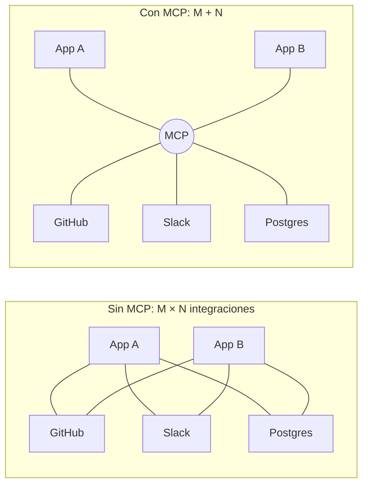
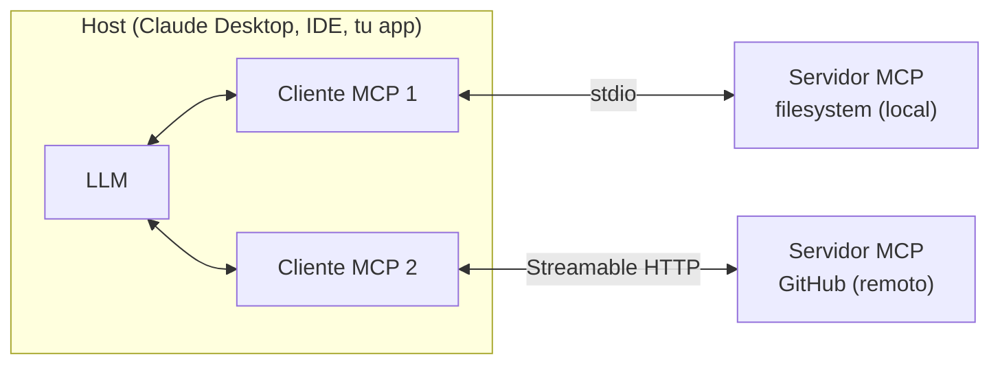
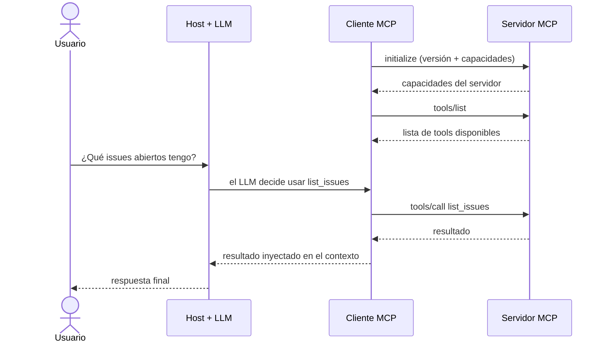

---
aliases:
  - Model Context Protocol
  - MCP
tags:
  - ia-llms
  - protocolos
  - agentes
categoria: IA / LLMs
created: 2026-09-27
---

# MCP (Model Context Protocol)

> [!abstract] Resumen
> MCP es un protocolo abierto (lanzado por Anthropic en noviembre de 2024 y luego donado a la Linux Foundation) que estandariza **cómo los LLMs se conectan con fuentes de datos y herramientas externas**: bases de datos, APIs (Slack, GitHub, Google Drive), sistemas de archivos o herramientas internas de una empresa.

> [!example] Analogía: el USB-C de las apps de IA
> Antes de USB-C, cada dispositivo necesitaba su propio cable. Antes de MCP, cada combinación LLM + herramienta necesitaba su propia integración. MCP es el conector único.

## Key points

- [k] Un servidor MCP se escribe **una vez** y lo puede usar cualquier host compatible
- [k] Expone tres primitivos: **tools** (acciones), **resources** (datos) y **prompts** (templates)
- [k] Usa **JSON-RPC 2.0** sobre dos transportes: **stdio** (local) y **Streamable HTTP** (remoto)
- [k] No reemplaza al [[Function calling]]: lo estandariza por encima

## Problema que resuelve

Sin MCP, cada integración entre un LLM y una fuente de datos requiere código custom: una integración **M × N** (M apps × N herramientas). Con MCP pasa a ser **M + N**.



Antes de MCP, el patrón típico era:
1. Definir funciones custom para cada integración (function calling)
2. Mantener ese código por separado para cada modelo/cliente que lo use
3. No había forma estándar de exponer "recursos" (documentos, datos) además de "acciones"

> [!info] Mismo truco que LSP
> MCP copia la idea del **LSP** (Language Server Protocol): así como el autocompletado de un lenguaje funciona igual en VS Code, Vim o cualquier editor que hable LSP, un servidor MCP funciona igual en cualquier host que hable MCP.

## Arquitectura

MCP sigue una arquitectura **cliente-servidor**:



| Pieza | Qué es |
|---|---|
| **Host** | La app que usa la persona (Claude Desktop, un IDE, una app custom). Puede correr varios clientes a la vez |
| **Cliente MCP** | Vive dentro del host y mantiene una conexión **1:1** con un servidor |
| **Servidor MCP** | Proceso liviano que expone tools, resources y prompts. Corre local (subproceso) o remoto (HTTP) |

## Los tres primitivos

### 1. Tools (herramientas)
Funciones que el modelo puede **invocar** para realizar acciones (leer un archivo, hacer una query, mandar un mensaje). Conceptualmente son el function calling de siempre, pero estandarizado.

```json
{
  "name": "get_weather",
  "description": "Obtiene el clima actual de una ciudad",
  "inputSchema": {
    "type": "object",
    "properties": {
      "city": { "type": "string" }
    },
    "required": ["city"]
  }
}
```

### 2. Resources (recursos)
Datos que el cliente puede **leer** (no ejecutar): archivos, resultados de queries, contenido de una página. Se identifican con URIs (`file:///ruta`, `postgres://tabla`).

### 3. Prompts (templates reusables)
Prompts predefinidos y parametrizables para flujos comunes (ej: "resumir este PR", "generar changelog").

> [!tip] Cómo no confundirlos: ¿quién tiene el control?
> | Primitivo | Lo controla | Ejemplo |
> |---|---|---|
> | Tools | El **modelo** (decide cuándo llamarlas) | `create_issue`, `run_query` |
> | Resources | La **aplicación** (host) | un archivo, el schema de una DB |
> | Prompts | El **usuario** (ej. como slash command) | `/resumir-pr` |

### Capacidades del lado del cliente

La comunicación va en los dos sentidos. El cliente también le ofrece cosas al servidor:

- [i] **Sampling**: el servidor le pide al cliente que llame al LLM por él (así el servidor no necesita su propia API key)
- [i] **Roots**: el cliente le indica al servidor qué directorios/URIs puede tocar
- [i] **Elicitation**: el servidor le pide al usuario (vía el cliente) un dato extra en medio de una operación

## Transportes

| Transporte | Cuándo | Cómo funciona |
|---|---|---|
| **stdio** | Servidores locales (filesystem, git) | El servidor corre como subproceso; se habla por stdin/stdout |
| **Streamable HTTP** | Servidores remotos (se conectan por URL) | HTTP POST, con SSE opcional para hacer streaming |

> [!note] Deprecado
> El transporte original "HTTP + SSE" fue reemplazado por Streamable HTTP. Si un tutorial viejo lo usa, está desactualizado.

Todos los mensajes usan **JSON-RPC 2.0**.

## Flujo típico



1. El host inicia un cliente y se conecta a un servidor.
2. `initialize`: negocian versión del protocolo y capacidades.
3. El cliente descubre qué hay disponible (`tools/list`, `resources/list`, `prompts/list`).
4. Durante la conversación, el LLM decide usar una tool y el cliente ejecuta `tools/call`.
5. El resultado vuelve al contexto del modelo.

## MCP vs. function calling tradicional

| | Function calling (API directa) | MCP |
|---|---|---|
| Alcance | Una integración de código puntual | Protocolo estándar, reusable entre clientes |
| Descubrimiento | Hardcodeado en el prompt/código | Dinámico (`tools/list`) |
| Recursos (datos) | No hay concepto separado | Primitivo propio (`resources`) |
| Reusabilidad | Baja (una implementación por app) | Alta (un servidor sirve a cualquier host) |

- [p] Escribís la integración una vez y funciona en cualquier host compatible
- [p] Los hosts descubren las tools en runtime, sin tocar código
- [p] Separa acciones (tools) de datos (resources)
- [c] Un proceso más que correr y mantener (el servidor)
- [c] Para una sola app con dos funciones, function calling directo es más simple
- [c] Suma superficie de ataque si conectás servidores de terceros sin revisarlos

## Ejemplo mínimo (Python, SDK oficial)

```python
from mcp.server.fastmcp import FastMCP

mcp = FastMCP("demo-server")

@mcp.tool()
def sumar(a: int, b: int) -> int:
    """Suma dos números"""
    return a + b

@mcp.resource("config://app")
def get_config() -> str:
    """Devuelve la configuración de la app"""
    return "modo=produccion"

if __name__ == "__main__":
    mcp.run(transport="stdio")
```

Para usarlo, se agrega una entrada en la configuración del host (ej. Claude Desktop) que apunte al comando que lo ejecuta.

> [!tip] Probarlo sin un host
> **MCP Inspector** permite conectarse a un servidor y llamar sus tools a mano:
> `npx @modelcontextprotocol/inspector`

## Seguridad

> [!warning] [[Prompt injection]] vía metadata
> Un servidor malicioso o mal escrito puede exponer tools con nombres engañosos o esconder instrucciones en las descripciones de tools y resources. El modelo lee esas descripciones, así que puede "obedecerlas". Solo conectar servidores de fuentes confiables.

> [!danger] Permisos
> - Los servidores locales (stdio) corren con **los mismos permisos que tu usuario** del sistema: no darles acceso a todo el filesystem si no hace falta.
> - Los servidores remotos necesitan autenticación (la spec recomienda **OAuth**) para no exponer tools sensibles.

## Ecosistema

- Servidores oficiales y de comunidad para GitHub, Slack, Google Drive, Postgres, filesystem, browsers, Notion y muchos más.
- Frameworks de agentes como LangChain y LlamaIndex tienen adaptadores para consumir servidores MCP como tools.
- SDKs oficiales: Python, TypeScript, Java, Kotlin, C#, Go, entre otros.
- Es la forma estándar de darles herramientas a los [[Agentes autónomos]], y resuelve el mismo problema que un [[RAG]] ("darle datos externos al LLM"): los resources de MCP pueden alimentar un RAG.
